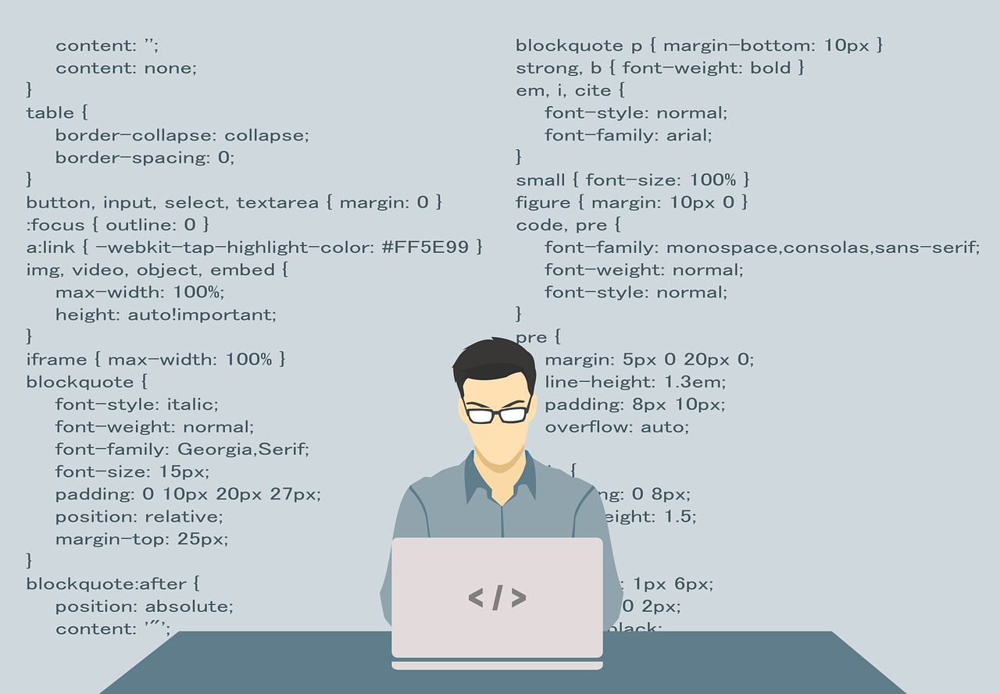
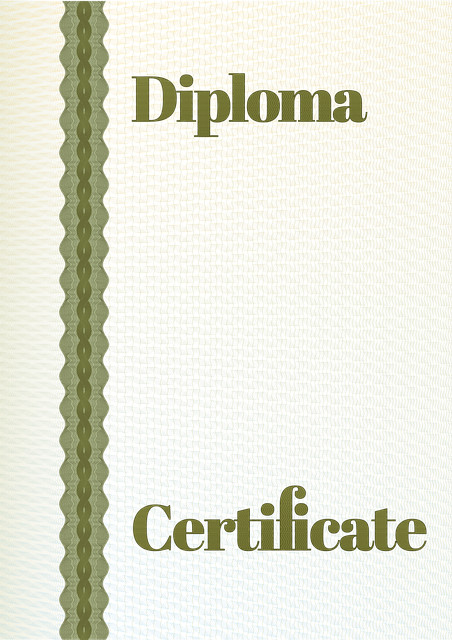

# Resumo

**Python:** 
1. Aprendi os fundamentos da linguagem de python
    • Sintaxe básica, variáveis e tipos de dados
    • Operadores aritméticos, lógicos e relacionais
    • Entrada e saída de dados
    •Estruturas de controle: if, else, elif, while, for...

2. Aprendi estruturas de dados
    • Listas, tuplas, dicionários e conjuntos
    • Operações com coleções
    • Compreensão de listas (list comprehensions)
    • Manipulação e iteração de dados

3. Aprendi programação orientada a objetos (POO)
    • Conceitos de classes, objetos, atributos e métodos
    • Encapsulamento, herança e polimorfismo
    • Métodos especiais (__init__, __str__, etc.)
    • Boas práticas em POO com Python

4. Aprendi programação funcional
    • Funções lambda
    • Funções map(), filter(), reduce()
    • Funções de alta ordem
    • Imutabilidade e funções puras

5. Aprendi sobre módulos, pacotes e bibliotecas
    • Criação e importação de módulos
    • Organização de projetos com pacotes
    • Uso de bibliotecas padrão e externas (via pip)
    • Ambientes virtuais com venv

7. Aprendi manipulação de arquivos e erros
    • Leitura e escrita em arquivos .txt e .csv
    • Blocos try/except, tratamento de exceções
    • Criação de logs e depuração simples

**Ciência de Dados:**
1. Aprendi Ciência de Dados com Jupyter Notebooks
    • Introdução ao ambiente Jupyter
    • Execução interativa de código Python
    • Documentação com células Markdown
    • Organização de análises em notebooks reutilizáveis

2. Aprendi sobre NumPy (Manipulação Numérica)
    • Criação e manipulação de arrays
    • Operações matemáticas e estatísticas
    • Indexação, slicing e broadcasting
    • Aplicações em dados estruturados e vetorização

3. Aprendi sobre Pandas (Manipulação e Análise de Dados)
    • Estruturas principais: Series e DataFrames
    • Leitura de dados (CSV, Excel, etc.)
    • Limpeza e transformação de dados
    • Filtragem, agrupamento, agregações e ordenações

4. Aprendi sobre Matplotlib (Visualização de Dados)
    • Conceitos básicos de visualização com pyplot
    • Criação de gráficos: linhas, barras, histogramas, dispersão (scatter)
    • Customização de títulos, rótulos, cores e estilos
    • Integração com pandas para visualizações rápidas

# Exercícios

1. ...
[Resposta Ex1.](./Exercicios/ex1.sql)

2. ...
[Resposta Ex2.](./Exercicios/ex2.py)

# Evidências

Ao executar o código do exercício ... observei que ... conforme podemos ver na imagem a seguir:

# Certificados

Certificado do Curso ABC

