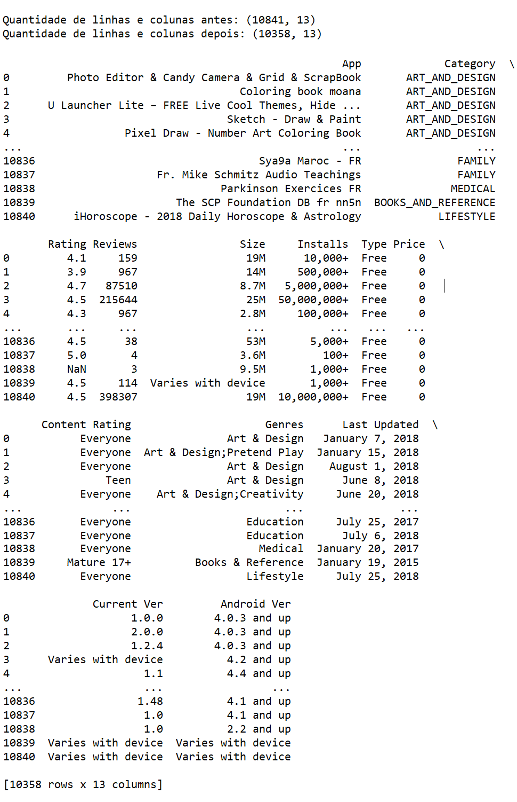
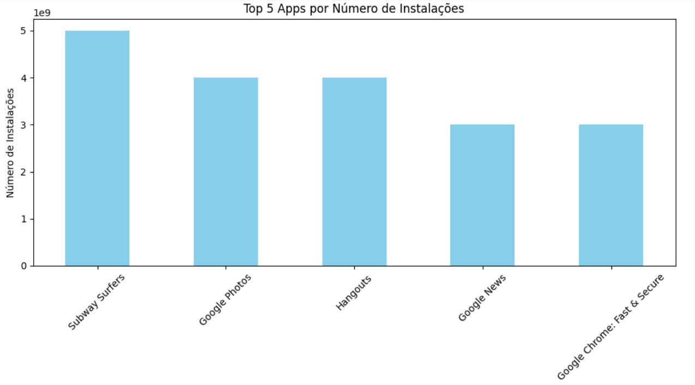
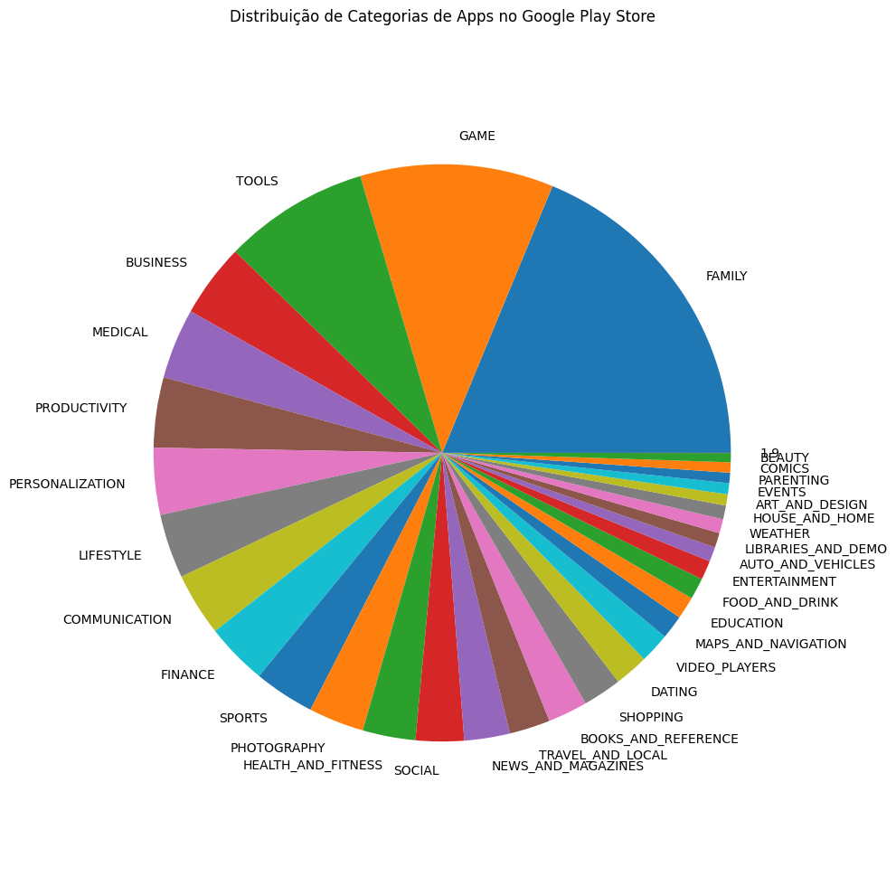
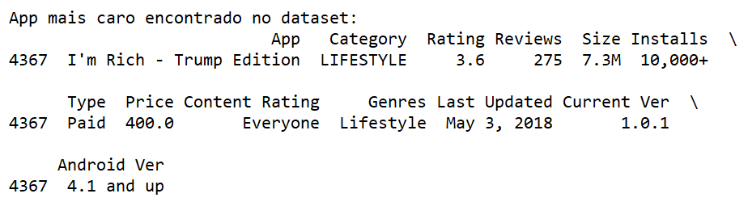
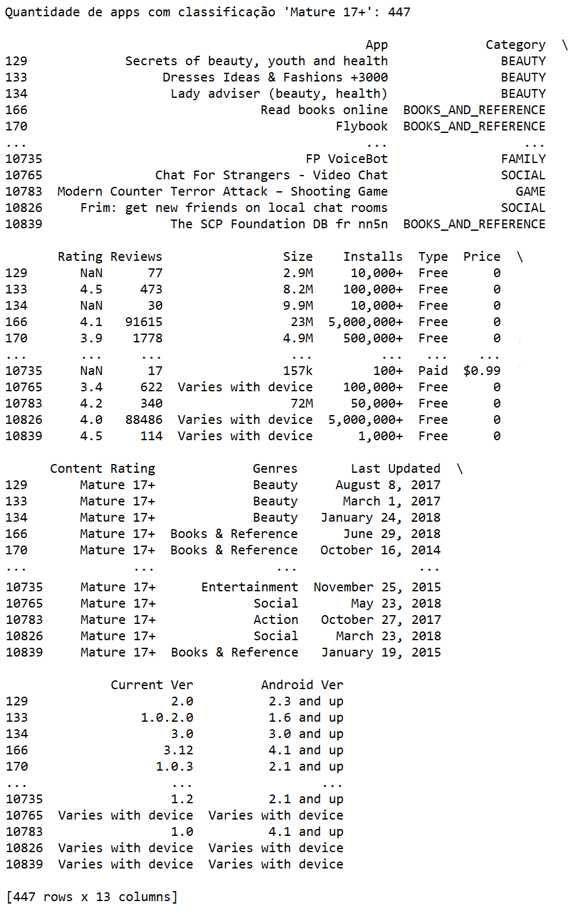
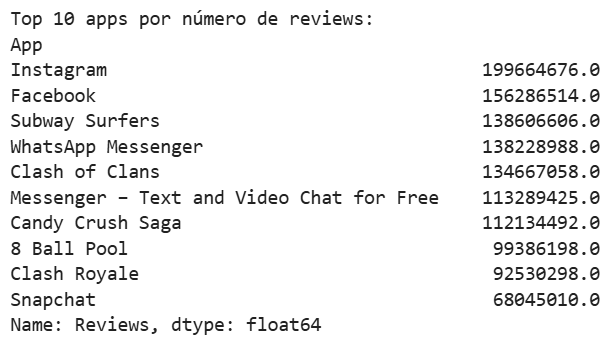
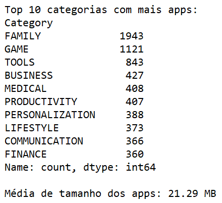
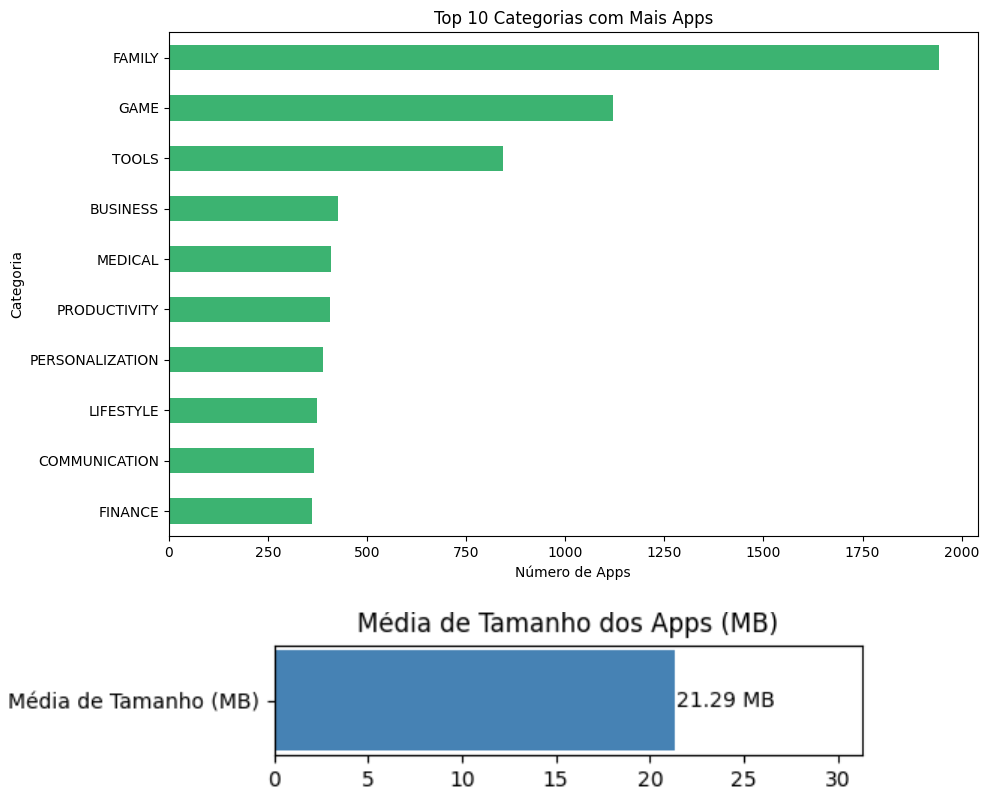

# Etapas


1. ... [Etapa I](etapa-1)

    Nessa etapa pode-se perceber com esse código:
    ```
    # Importa as bibliotecas necessárias
    import pandas as pd

    # Lê o arquivo CSV para um DataFrame do pandas
    df = pd.read_csv('googleplaystore.csv')

    # Variável para mostrar a quantidade de linhas e colunas antes da remoção das linhas duplicadas
    antes = df.shape

    # Remove as linhas duplicadas com base em todas as colunas
    df_sem_duplicatas = df.drop_duplicates()

    # Variável para mostrar a quantidade de linhas e colunas após a remoção das linhas duplicadas
    depois = df_sem_duplicatas.shape

    # Imprime a quantidade de linhas e colunas antes e depois da remoção das linhas duplicadas
    print(f'Quantidade de linhas e colunas antes: {antes}')
    print(f'Quantidade de linhas e colunas depois: {depois}\n')

    # Imprime o DataFrame sem duplicatas
    print(df_sem_duplicatas)
    ```
    Obtive esse retorno

    
---

2. ... [Etapa II](etapa-2)

    Nessa etapa pode-se perceber com esse código:
    ```
    # Importa as bibliotecas necessárias
    import pandas as pd
    import matplotlib.pyplot as plt

    # Lê o arquivo CSV para um DataFrame do pandas
    df = pd.read_csv('googleplaystore.csv')

    # Remove as linhas duplicadas com base em todas as colunas
    df_sem_duplicatas = df.drop_duplicates()

    # Remove vírgulas e sinais de '+' da coluna 'Installs' e converte para tipo numérico
    df_sem_duplicatas['Installs'] = df_sem_duplicatas['Installs'].str.replace(',', '').str.replace('+', '')
    df_sem_duplicatas['Installs'] = pd.to_numeric(df_sem_duplicatas['Installs'], errors='coerce')

    # Remove linhas com valores nulos na coluna 'Installs' após a conversão
    df_installs_validos = df_sem_duplicatas.dropna(subset=['Installs'])

    # Agrupa os dados por nome do app e soma as instalações (caso um app apareça mais de uma vez)
    apps_instalacoes = df_installs_validos.groupby('App')['Installs'].sum()

    # Ordena os apps por número de instalações em ordem decrescente e pega os 5 primeiros
    top_5_apps = apps_instalacoes.sort_values(ascending=False).head(5)

    plt.figure(figsize=(10,6))
    top_5_apps.plot(kind='bar', color='skyblue')
    plt.title('Top 5 Apps por Número de Instalações')
    plt.xlabel('App')
    plt.ylabel('Número de Instalações')
    plt.xticks(rotation=45)
    plt.tight_layout()
    plt.show()
    ```
    Obtive esse retorno
    
    
---

3. ... [Etapa III](etapa-3)

    Nessa etapa pode-se perceber com esse código:
    ```
    # Importa as bibliotecas necessárias
    import pandas as pd
    import matplotlib.pyplot as plt

    # Lê o arquivo CSV para um DataFrame do pandas
    df = pd.read_csv('googleplaystore.csv')

    # Remove as linhas duplicadas com base em todas as colunas
    df_sem_duplicatas = df.drop_duplicates()

    # Conta quantas vezes cada categoria aparece no dataset
    frequencia_categorias = df_sem_duplicatas['Category'].value_counts()

    # ## Plotagem do gráfico de pizza
    # Cria um gráfico de pizza com as frequências das categorias
    plt.figure(figsize=(10,10))  # Define o tamanho da figura
    plt.pie(frequencia_categorias, labels=frequencia_categorias.index) # labels: nomes das categorias
    plt.title('Distribuição de Categorias de Apps no Google Play Store')  # Título do gráfico
    plt.axis('equal')  # Garante que o gráfico seja um círculo
    plt.tight_layout()  # Ajusta o layout
    plt.show()  # Exibe o gráfico
    ```
    Obtive esse retorno
    
    
---

4. ... [Etapa IV](etapa-4)

    Nessa etapa pode-se perceber com esse código:
    ```
    # Importa as bibliotecas necessárias
    import pandas as pd

    # Lê o arquivo CSV para um DataFrame do pandas
    df = pd.read_csv('googleplaystore.csv')

    # Remove as linhas duplicadas com base em todas as colunas
    df_sem_duplicatas = df.drop_duplicates()

    # Remove o símbolo de dólar da coluna 'Price' e converte para numérico
    df_sem_duplicatas['Price'] = df_sem_duplicatas['Price'].str.replace('$', '')
    df_sem_duplicatas['Price'] = pd.to_numeric(df_sem_duplicatas['Price'], errors='coerce')

    # Remove linhas com valores nulos na coluna 'Price'
    df_precos_validos = df_sem_duplicatas.dropna(subset=['Price'])

    # Localiza a linha onde o preço é o maior valor encontrado
    app_mais_caro = df_precos_validos[df_precos_validos['Price'] == df_precos_validos['Price'].max()]

    # Exibe as informações do app mais caro
    print("App mais caro encontrado no dataset:")
    print(app_mais_caro)
    ```
    Obtive esse retorno
    
    
---

5. ... [Etapa V](etapa-5)

    Nessa etapa pode-se perceber com esse código:
    ```
    # Importa as bibliotecas necessárias
    import pandas as pd

    # Lê o arquivo CSV para um DataFrame do pandas
    df = pd.read_csv('googleplaystore.csv')

    # Remove as linhas duplicadas com base em todas as colunas
    df_sem_duplicatas = df.drop_duplicates()

    # Filtra o DataFrame para manter apenas os apps com 'Content Rating' igual a "Mature 17+"
    apps_mature = df_sem_duplicatas[df_sem_duplicatas['Content Rating'] == 'Mature 17+']

    # Conta e exibe o número de apps classificados como "Mature 17+"
    quantidade_mature = apps_mature.shape[0]

    # Imprime a quantidade total e o DataFrame
    print(f"Quantidade de apps com classificação 'Mature 17+': {quantidade_mature}\n")
    print(apps_mature)
    ```
    Obtive esse retorno
    
    
---

6. ... [Etapa VI](etapa-6)

    Nessa etapa pode-se perceber com esse código:
    ```
    # Importa as bibliotecas necessárias
    import pandas as pd

    # Lê o arquivo CSV para um DataFrame do pandas
    df = pd.read_csv('googleplaystore.csv')

    # Remove as linhas duplicadas com base em todas as colunas
    df_sem_duplicatas = df.drop_duplicates()

    # Converte a coluna 'Reviews' para tipo numérico (inteiro), tratando possíveis erros
    df_sem_duplicatas['Reviews'] = pd.to_numeric(df_sem_duplicatas['Reviews'], errors='coerce')

    # Remove linhas onde o número de reviews é nulo
    df_reviews_validos = df_sem_duplicatas.dropna(subset=['Reviews'])

    # Agrupa os dados por nome do app e soma os reviews (caso o mesmo app apareça mais de uma vez)
    apps_reviews = df_reviews_validos.groupby('App')['Reviews'].sum()

    # Ordena os apps pelo número de reviews em ordem decrescente e seleciona os 10 primeiros
    top_10_reviews = apps_reviews.sort_values(ascending=False).head(10)

    # Mostra os 10 apps com maior número de reviews e seus respectivos valores
    print("Top 10 apps por número de reviews:")
    print(top_10_reviews)
    ```
    Obtive esse retorno
    
    
---

7. ... [Etapa VII](etapa-7)

    Nessa etapa pode-se perceber com esse código:
    ```
    # Importa as bibliotecas necessárias
    import pandas as pd

    # Lê o arquivo CSV para um DataFrame do pandas
    df = pd.read_csv('googleplaystore.csv')

    # Remove as linhas duplicadas com base em todas as colunas
    df_sem_duplicatas = df.drop_duplicates()

    # Top 10 categorias com mais apps
    # Conta quantos apps existem por categoria
    categorias_top10 = df_sem_duplicatas['Category'].value_counts().head(10)

    # Exibição em formato de lista
    print("Top 10 categorias com mais apps:")
    print(categorias_top10)

    # Média do tamanho dos apps
    # Substitui 'Varies with device' por NaN (não disponível)
    df_sem_duplicatas['Size'] = df_sem_duplicatas['Size'].replace('Varies with device', pd.NA)

    # Remove os caracteres 'M' e 'k', convertendo os valores para MB
    df_sem_duplicatas['Size_MB'] = df_sem_duplicatas['Size'].str.replace('M', '')
    df_sem_duplicatas['Size_MB'] = df_sem_duplicatas['Size_MB'].str.replace('k', '')
    df_sem_duplicatas['Size_MB'] = pd.to_numeric(df_sem_duplicatas['Size_MB'], errors='coerce')

    # Converte os tamanhos originalmente em kilobytes (k) para MB (dividindo por 1024)
    df_sem_duplicatas.loc[df_sem_duplicatas['Size'].str.contains('k', na=False), 'Size_MB'] /= 1024

    # Cálculo da média
    media_tamanho_mb = df_sem_duplicatas['Size_MB'].mean()

    # Exibição do resultado
    print(f"\nMédia de tamanho dos apps: {media_tamanho_mb:.2f} MB")
    ```
    Obtive esse retorno
    
    
---

8. ... [Etapa VIII](etapa-8)

    Nessa etapa pode-se perceber com esse código:
    ```
    # Importa as bibliotecas necessárias
    import pandas as pd
    import matplotlib.pyplot as plt

    # Lê o arquivo CSV para um DataFrame do pandas
    df = pd.read_csv('googleplaystore.csv')

    # Remove as linhas duplicadas com base em todas as colunas
    df_sem_duplicatas = df.drop_duplicates()

    # Top 10 categorias com mais apps
    # Conta quantos apps existem por categoria
    categorias_top10 = df_sem_duplicatas['Category'].value_counts().head(10)

    # Gráfico 1 - Top 10 categorias com mais apps (barra horizontal)
    plt.figure(figsize=(10, 6))  # Define o tamanho da figura
    categorias_top10.plot(kind='barh', color='mediumseagreen')  # Gráfico de barras horizontais
    # Adiciona título e rótulos aos eixos
    plt.title('Top 10 Categorias com Mais Apps')
    plt.xlabel('Número de Apps')
    plt.ylabel('Categoria')
    # Inverte o eixo Y para mostrar o mais popular no topo
    plt.gca().invert_yaxis()
    # Ajusta layout e exibe
    plt.tight_layout()
    plt.show()

    # Média do tamanho dos apps
    # Substitui 'Varies with device' por NaN (não disponível)
    df_sem_duplicatas['Size'] = df_sem_duplicatas['Size'].replace('Varies with device', pd.NA)

    # Remove os caracteres 'M' e 'k', convertendo os valores para MB
    df_sem_duplicatas['Size_MB'] = df_sem_duplicatas['Size'].str.replace('M', '')
    df_sem_duplicatas['Size_MB'] = df_sem_duplicatas['Size_MB'].str.replace('k', '')
    df_sem_duplicatas['Size_MB'] = pd.to_numeric(df_sem_duplicatas['Size_MB'], errors='coerce')

    # Converte os tamanhos originalmente em kilobytes (k) para MB (dividindo por 1024)
    df_sem_duplicatas.loc[df_sem_duplicatas['Size'].str.contains('k', na=False), 'Size_MB'] /= 1024

    # Cálculo da média
    media_tamanho_mb = df_sem_duplicatas['Size_MB'].mean()

    # Gráfico 2 - Média de tamanho dos apps em MB (barra única)
    plt.figure(figsize=(6, 1.5))  # Figura mais larga e baixa, estilo "medidor"
    plt.barh(['Média de Tamanho (MB)'], [media_tamanho_mb], color='steelblue')
    # Adiciona valores diretamente no gráfico
    plt.text(media_tamanho_mb + 0.1, 0, f'{media_tamanho_mb:.2f} MB', va='center')
    # Adiciona título e ajusta layout
    plt.title('Média de Tamanho dos Apps (MB)')
    plt.xlim(0, media_tamanho_mb + 10)  # Ajusta o eixo X para deixar espaço
    plt.tight_layout()
    plt.show()
    ```
    Obtive esse retorno
    
    
---