# Resumo

**Python:** 
1. Aprendi os fundamentos da linguagem de python
    • Sintaxe básica, variáveis e tipos de dados
    • Operadores aritméticos, lógicos e relacionais
    • Entrada e saída de dados
    •Estruturas de controle: if, else, elif, while, for...

2. Aprendi estruturas de dados
    • Listas, tuplas, dicionários e conjuntos
    • Operações com coleções
    • Compreensão de listas (list comprehensions)
    • Manipulação e iteração de dados

3. Aprendi programação orientada a objetos (POO)
    • Conceitos de classes, objetos, atributos e métodos
    • Encapsulamento, herança e polimorfismo
    • Métodos especiais (__init__, __str__, etc.)
    • Boas práticas em POO com Python

4. Aprendi programação funcional
    • Funções lambda
    • Funções map(), filter(), reduce()
    • Funções de alta ordem
    • Imutabilidade e funções puras

5. Aprendi sobre módulos, pacotes e bibliotecas
    • Criação e importação de módulos
    • Organização de projetos com pacotes
    • Uso de bibliotecas padrão e externas (via pip)
    • Ambientes virtuais com venv

7. Aprendi manipulação de arquivos e erros
    • Leitura e escrita em arquivos .txt e .csv
    • Blocos try/except, tratamento de exceções
    • Criação de logs e depuração simples

**Ciência de Dados:**
1. Aprendi Ciência de Dados com Jupyter Notebooks
    • Introdução ao ambiente Jupyter
    • Execução interativa de código Python
    • Documentação com células Markdown
    • Organização de análises em notebooks reutilizáveis

2. Aprendi sobre NumPy (Manipulação Numérica)
    • Criação e manipulação de arrays
    • Operações matemáticas e estatísticas
    • Indexação, slicing e broadcasting
    • Aplicações em dados estruturados e vetorização

3. Aprendi sobre Pandas (Manipulação e Análise de Dados)
    • Estruturas principais: Series e DataFrames
    • Leitura de dados (CSV, Excel, etc.)
    • Limpeza e transformação de dados
    • Filtragem, agrupamento, agregações e ordenações

4. Aprendi sobre Matplotlib (Visualização de Dados)
    • Conceitos básicos de visualização com pyplot
    • Criação de gráficos: linhas, barras, histogramas, dispersão (scatter)
    • Customização de títulos, rótulos, cores e estilos
    • Integração com pandas para visualizações rápidas

# Exercícios

1. ...
[Resposta Ex1.](./Exercicios/exerciciosPB/python1_básico/ex1.py)

2. ...
[Resposta Ex2.](./Exercicios/exerciciosPB/python1_básico/ex1.py)

3. ...
[Resposta Ex3.](./Exercicios/exerciciosPB/python1_básico/ex3.py)

4. ...
[Resposta Ex4.](./Exercicios/exerciciosPB/python1_básico/ex4.py)

5. ...
[Resposta Ex5.](./Exercicios/exerciciosPB/python1_básico/ex5.py)

6. ...
[Resposta Ex6.](./Exercicios/exerciciosPB/python1_básico/ex6.py)

7. ...
[Resposta Ex7.](./Exercicios/exerciciosPB/python1_básico/ex7.py)

8. ...
[Resposta Ex8.](./Exercicios/exerciciosPB/python1_básico/ex8.py)

9. ...
[Resposta Ex9.](./Exercicios/exerciciosPB/python1_básico/ex9.py)

10. ...
[Resposta Ex10.](./Exercicios/exerciciosPB/python1_básico/ex10.py)

11. ...
[Resposta Ex11.](./Exercicios/exerciciosPB/python1_básico/ex11.py)

12. ...
[Resposta Ex12.](./Exercicios/exerciciosPB/python1_básico/ex12.py)

13. ...
[Resposta Ex13.](./Exercicios/exerciciosPB/python1_básico/ex13.py)

14. ...
[Resposta Ex14.](./Exercicios/exerciciosPB/python1_básico/ex14.py)

15. ...
[Resposta Ex15.](./Exercicios/exerciciosPB/python2_avançado1/ex15.py)

16. ...
[Resposta Ex16.](./Exercicios/exerciciosPB/python2_avançado1/ex16.py)

17. ...
[Resposta Ex17.](./Exercicios/exerciciosPB/python2_avançado1/ex17.py)

18. ...
[Resposta Ex18.](./Exercicios/exerciciosPB/python2_avançado1/ex18.py)

19. ...
[Resposta Ex19.](./Exercicios/exerciciosPB/python2_avançado1/ex19.py)

20. ...
[Resposta Ex20.](./Exercicios/exerciciosPB/python3_avançado2/ex20.py)

21. ...
[Resposta Ex21.](./Exercicios/exerciciosPB/python3_avançado2/ex21.py)

22. ...
[Resposta Ex22.](./Exercicios/exerciciosPB/python3_avançado2/ex22.py)

23. ...
[Resposta Ex23.](./Exercicios/exerciciosPB/python3_avançado2/ex23.py)

24. ...
[Resposta Ex24.](./Exercicios/exerciciosPB/python3_avançado2/ex24.py)

25. ...
[Resposta Ex25.](./Exercicios/exerciciosPB/python3_avançado2/ex25.py)

26. ...
[Resposta Ex26.](./Exercicios/exerciciosPB/python3_avançado2/ex26.py)

27. ...
[Resposta etapa1.](./Exercicios/exerciciosPB/python4_etl/etapa1.py)

28. ...
[Resposta etapa2.](./Exercicios/exerciciosPB/python4_etl/etapa2.py)

29. ...
[Resposta etapa3.](./Exercicios/exerciciosPB/python4_etl/etapa3.py)

30. ...
[Resposta etapa4.](./Exercicios/exerciciosPB/python4_etl/etapa4.py)

31. ...
[Resposta etapa5.](./Exercicios/exerciciosPB/python4_etl/etapa5.py)

# Evidências

Ao executar o código do exercício 1, observei que o resultado(saída) que a questão desejava era uma nova lista contendo apenas números ímpares, o qual foi obtido com sucesso conforme podemos ver na imagem a seguir:

-

Ao executar o código do exercício 2, observei que o resultado(saída) que a questão desejava era uma frase verificando se cada uma das palavras da lista era um palíndromo ou não, o qual foi obtido com sucesso conforme podemos ver na imagem a seguir:

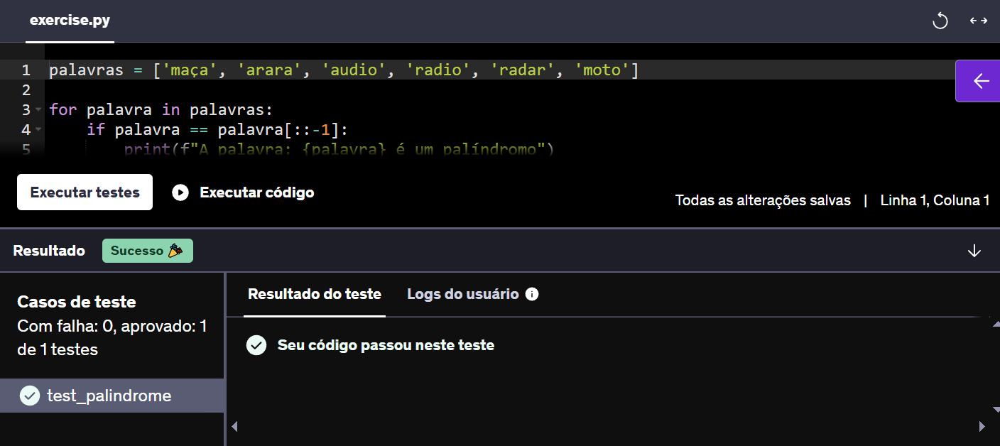
-

Ao executar o código do exercício 3, observei que o resultado(saída) que a questão desejava era uma frase estruturada com índice, nome e idade de cada uma das pessoas da lista, o qual foi obtido com sucesso conforme podemos ver na imagem a seguir:

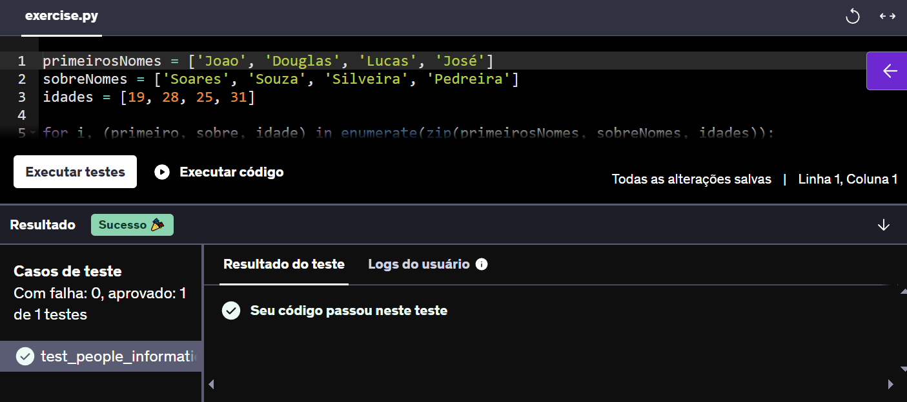
-

Ao executar o código do exercício 4, observei que o resultado(saída) que a questão desejava era uma nova lista sem elementos duplicados a partir de uma função, o qual foi obtido com sucesso conforme podemos ver na imagem a seguir:

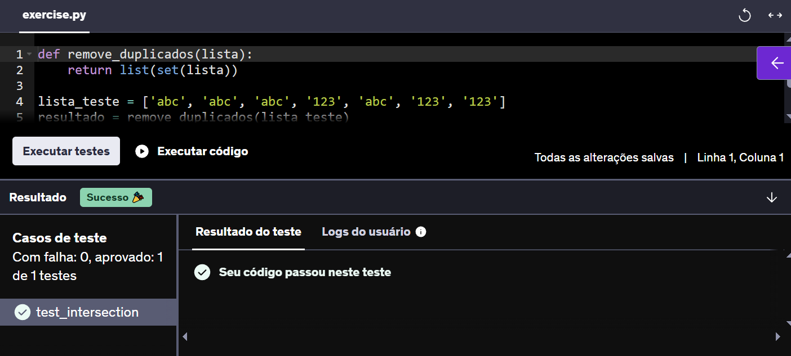
-

Ao executar o código do exercício 5, observei que o resultado(saída) que a questão desejava era a impressão de todo o conteúdo dentro do arquivo 'person.json', o qual foi obtido com sucesso conforme podemos ver na imagem a seguir:

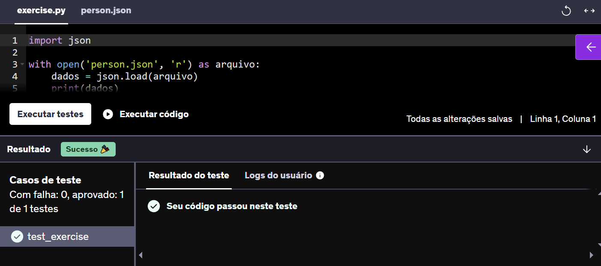
-

Ao executar o código do exercício 6, observei que o resultado(saída) que a questão desejava era uma nova lista com todos os elementos em potência 2 a partir de uma função preestabelecida, o qual foi obtido com sucesso conforme podemos ver na imagem a seguir:

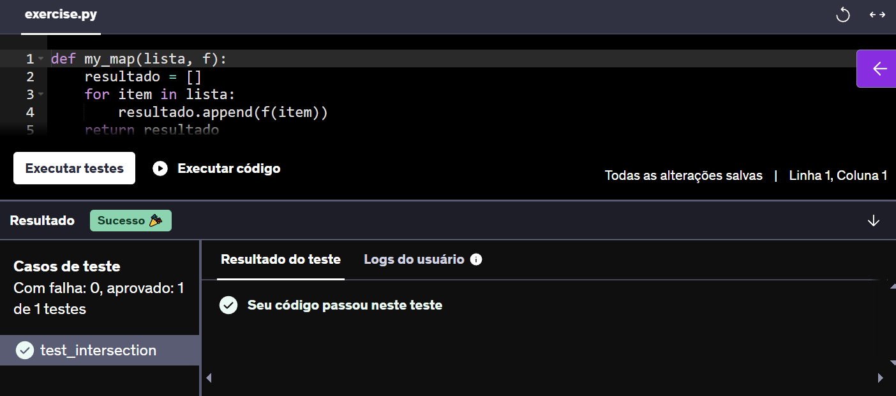
-

Ao executar o código do exercício 7, observei que o resultado(saída) que a questão desejava era a impressão de todo o conteúdo dentro do arquivo 'arquivo_texto.txt', o qual foi obtido com sucesso conforme podemos ver na imagem a seguir:

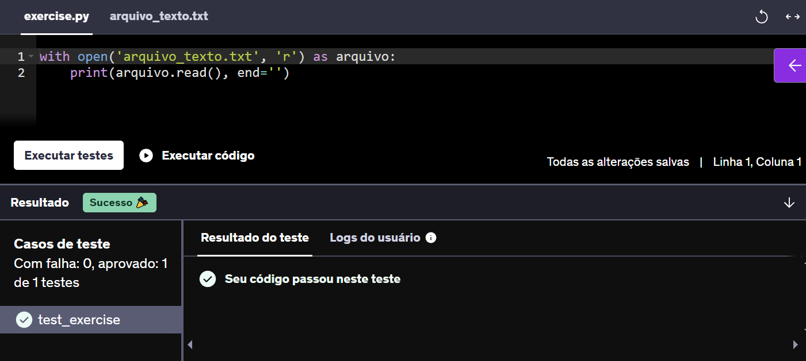
-

Ao executar o código do exercício 8, observei que o resultado(saída) que a questão desejava era a impressão dos valores de cada parâmetro recebido, o qual foi obtido com sucesso conforme podemos ver na imagem a seguir:

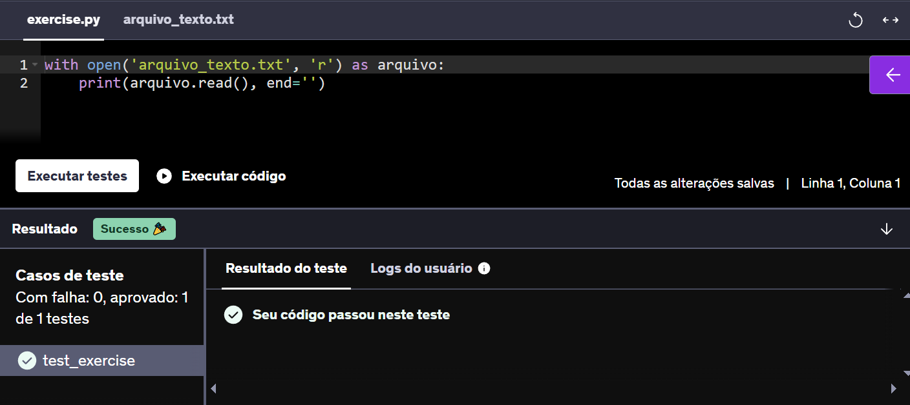
-

Ao executar o código do exercício 9, observei que o resultado(saída) que a questão desejava era o ligamento e desligamento da lâmpada através de funções de uma classe, o qual foi obtido com sucesso conforme podemos ver na imagem a seguir:

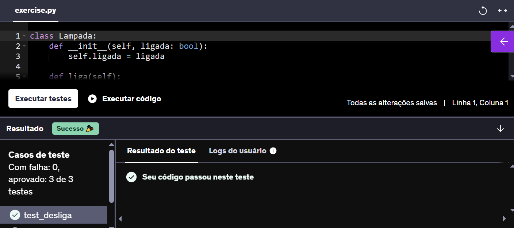
-

Ao executar o código do exercício 10, observei que o resultado(saída) que a questão desejava era a soma dos valores de uma string, o qual foi obtido com sucesso conforme podemos ver na imagem a seguir:

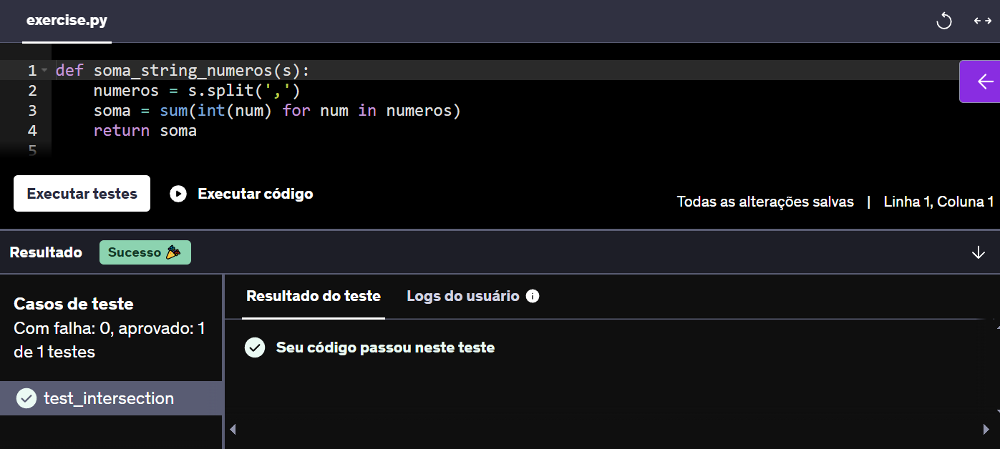
-

Ao executar o código do exercício 11, observei que o resultado(saída) que a questão desejava era 3 listas divididas em partes iguais de uma lista maior, o qual foi obtido com sucesso conforme podemos ver na imagem a seguir:

-

Ao executar o código do exercício 12, observei que o resultado(saída) que a questão desejava era uma lista com valores não duplicados de um dicionário, o qual foi obtido com sucesso conforme podemos ver na imagem a seguir:

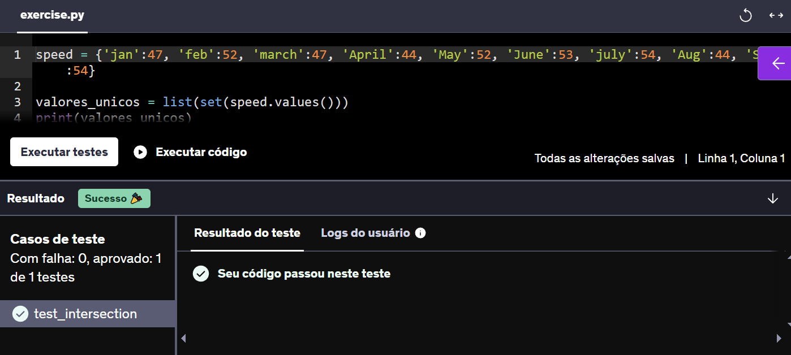
-

Ao executar o código do exercício 13, observei que o resultado(saída) que a questão desejava era uma lista com valores não duplicados de um dicionário, o qual foi obtido com sucesso conforme podemos ver na imagem a seguir:

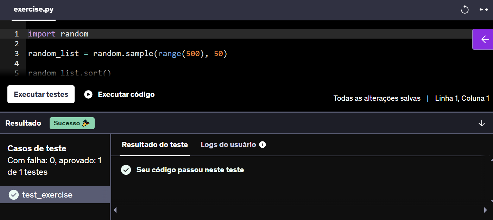
-

Ao executar o código do exercício 14, observei que o resultado(saída) que a questão desejava era a impressão da lista de trás para frente, o qual foi obtido com sucesso conforme podemos ver na imagem a seguir:

-

Ao executar o código do exercício 15, observei que o resultado(saída) que a questão desejava era a impressão de frases a partir de duas classes que herdam de uma superclasse, o qual foi obtido com sucesso conforme podemos ver na imagem a seguir:

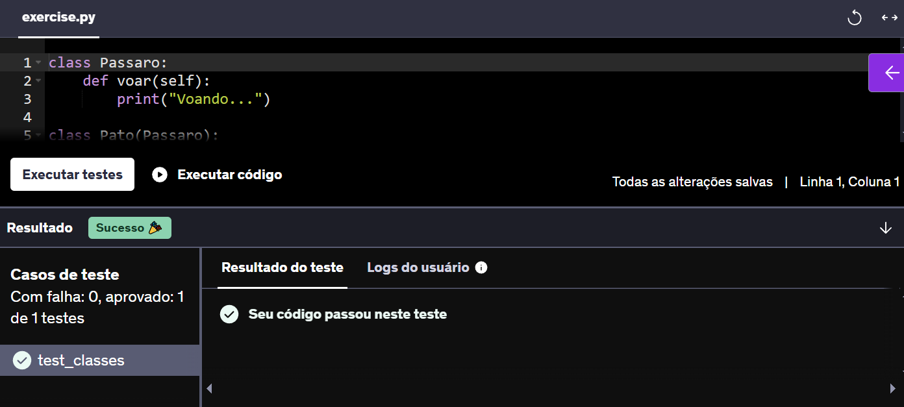
-

Ao executar o código do exercício 16, observei que o resultado(saída) que a questão desejava era a impressão de atributos privado e público a partir de uma classe, o qual foi obtido com sucesso conforme podemos ver na imagem a seguir:

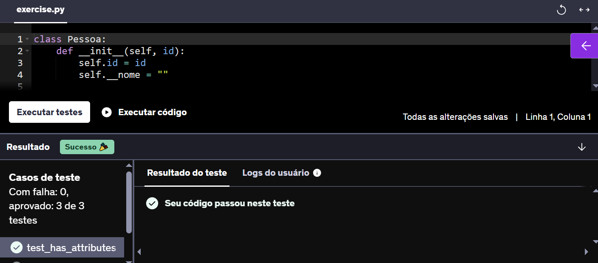
-

Ao executar o código do exercício 17, observei que o resultado(saída) que a questão desejava era a impressão de soma e subtração de dois parâmetros a partir de uma classe, o qual foi obtido com sucesso conforme podemos ver na imagem a seguir:

-

Ao executar o código do exercício 18, observei que o resultado(saída) que a questão desejava era a impressão de duas listas, uma em ordem crescente e outra decrescente, a partir de uma classe, o qual foi obtido com sucesso conforme podemos ver na imagem a seguir:

-

Ao executar o código do exercício 19, observei que o resultado(saída) que a questão desejava era a impressão de frases com atributos de uma classe, o qual foi obtido com sucesso conforme podemos ver na imagem a seguir:

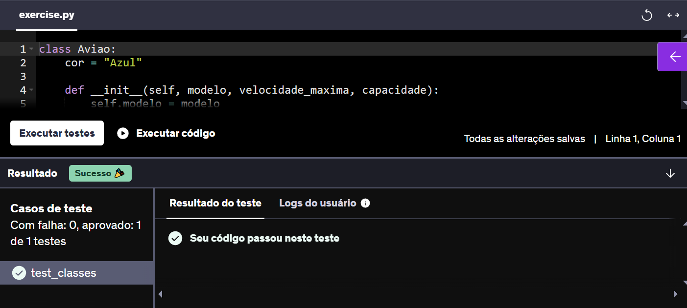
-

Ao executar o código do exercício 20, observei que o resultado(saída) que a questão desejava era a lista dos 5 maiores números pares em ordem decrescente e a soma destes valores, o qual foi obtido com sucesso conforme podemos ver na imagem a seguir:

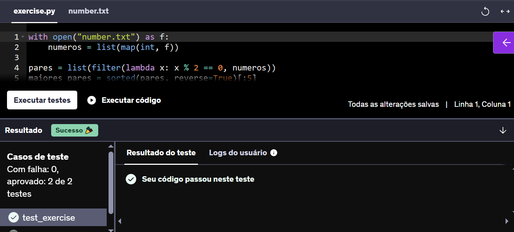
-

Ao executar o código do exercício 21, observei que o resultado(saída) que a questão desejava era a contagem de vogais presentes em uma string através de uma função, o qual foi obtido com sucesso conforme podemos ver na imagem a seguir:

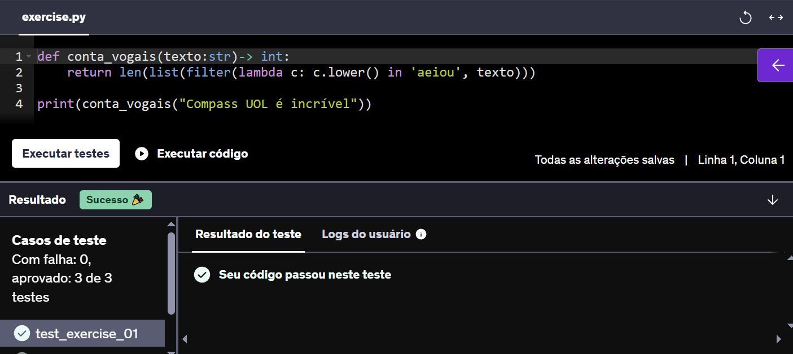
-

Ao executar o código do exercício 22, observei que o resultado(saída) que a questão desejava era o cálculo do valor final de lançamentos bancários a partir de uma função que recebe lista de tuplas, o qual foi obtido com sucesso conforme podemos ver na imagem a seguir:

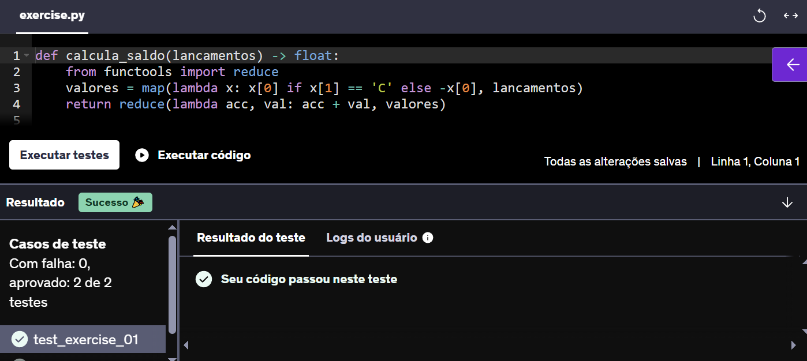
-

Ao executar o código do exercício 23, observei que o resultado(saída) que a questão desejava era o maior valor dos operandos a partir de uma função que também recebia os operadores, o qual foi obtido com sucesso conforme podemos ver na imagem a seguir:

-

Ao executar o código do exercício 24, observei que o resultado(saída) que a questão desejava era a impressão de strings ordenado pelo nome do estudante com padrão preestabelecido de um arquivo CSV, o qual foi obtido com sucesso conforme podemos ver na imagem a seguir:

-

Ao executar o código do exercício 25, observei que o resultado(saída) que a questão desejava era a lista de tuplas que continha o produto e o seu respectivo preço, ordenado pelo preço, o qual foi obtido com sucesso conforme podemos ver na imagem a seguir:

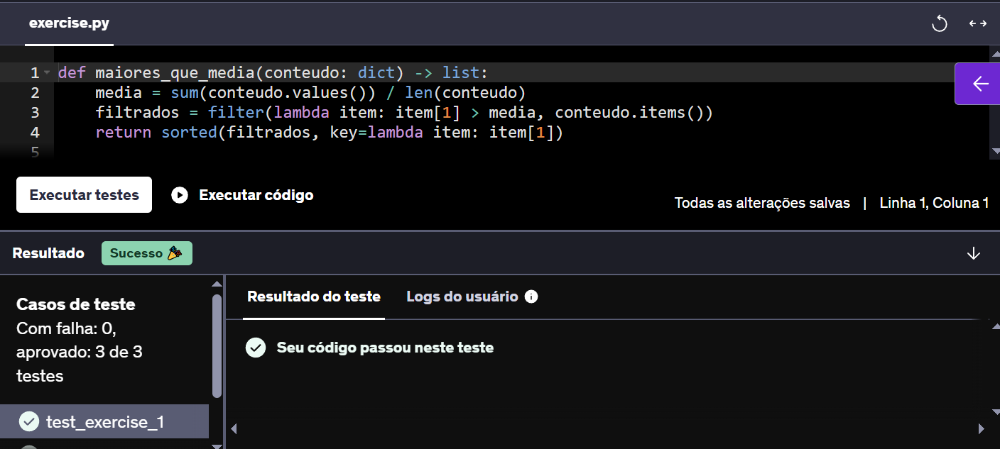
-

Ao executar o código do exercício 26, observei que o resultado(saída) que a questão desejava era um generator para os valores pares no intervalo, o qual foi obtido com sucesso conforme podemos ver na imagem a seguir:

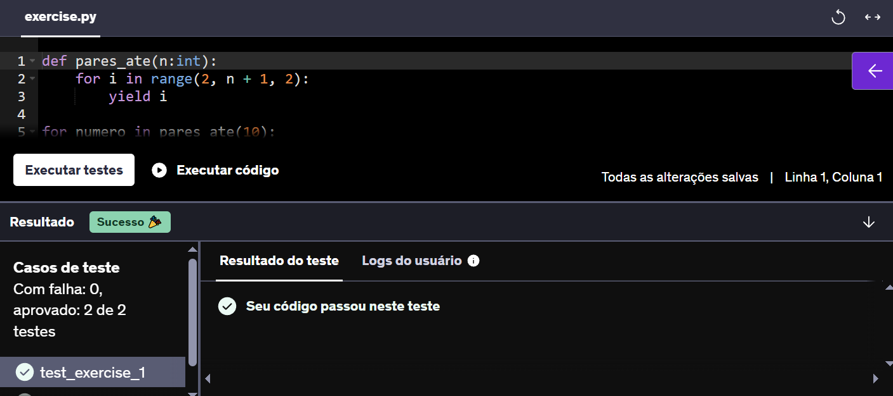
-

Ao executar o código do exercício da etapa 1 de ETL, observei que o resultado(saída) que a questão desejava era o ator/atriz com maior número de filmes e a respectiva quantidade, o qual foi obtido com sucesso conforme podemos ver na imagem a seguir:

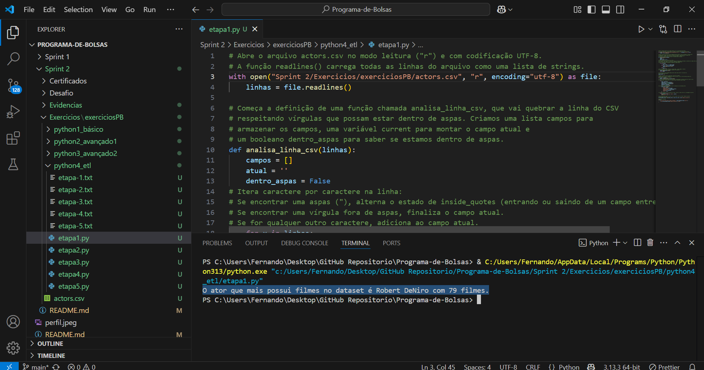
-

Ao executar o código do exercício da etapa 2 de ETL, observei que o resultado(saída) que a questão desejava era a média de receita de bilheteria bruta por filme, o qual foi obtido com sucesso conforme podemos ver na imagem a seguir:

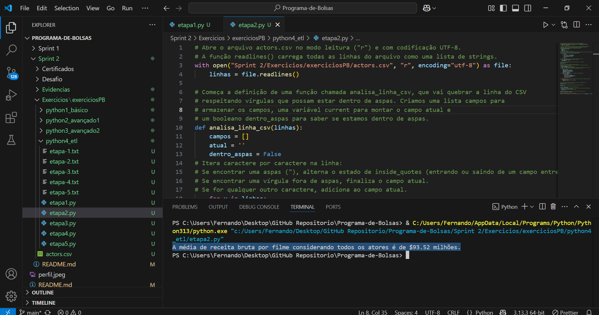
-

Ao executar o código do exercício da etapa 3 de ETL, observei que o resultado(saída) que a questão desejava era o ator/atriz com a maior média de receita de bilheteria bruta por filme, o qual foi obtido com sucesso conforme podemos ver na imagem a seguir:

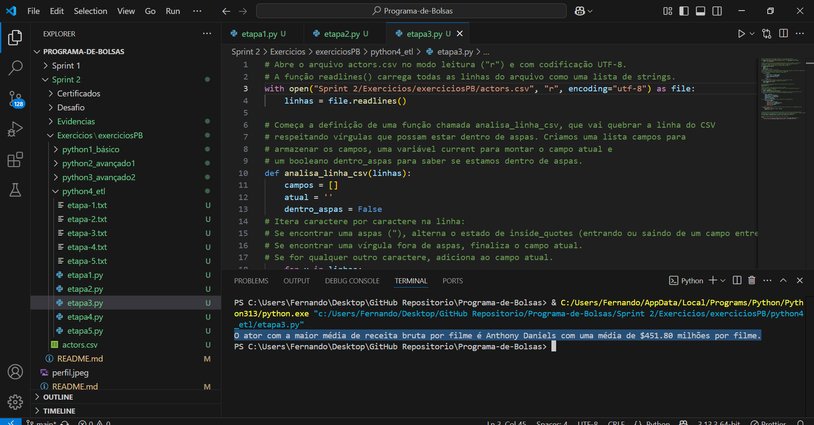
-

Ao executar o código do exercício da etapa 4 de ETL, observei que o resultado(saída) que a questão desejava era uma lista de contagem dos filmes de maior bilheteria que os atores atuaram, ordendando-os de forma decrescente pela quantidade de vezes que estavam presentes, seguindo um padrão de impressão, o qual foi obtido com sucesso conforme podemos ver na imagem a seguir:

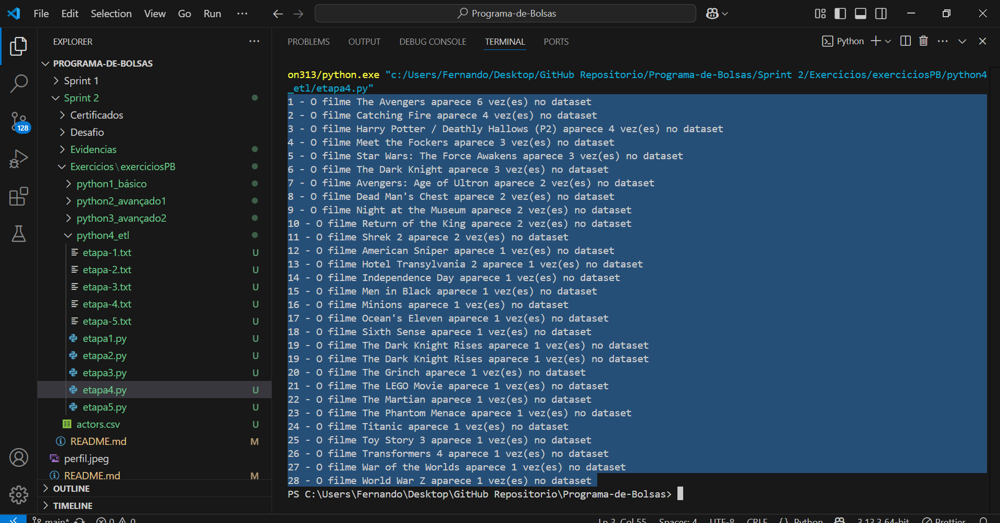
-

Ao executar o código do exercício da etapa 5 de ETL, observei que o resultado(saída) que a questão desejava era uma lista dos atores ordenada de forma decrescente pela receita bruta de bilheteria de seus filmes, seguindo um padrão de impressão, o qual foi obtido com sucesso conforme podemos ver na imagem a seguir:

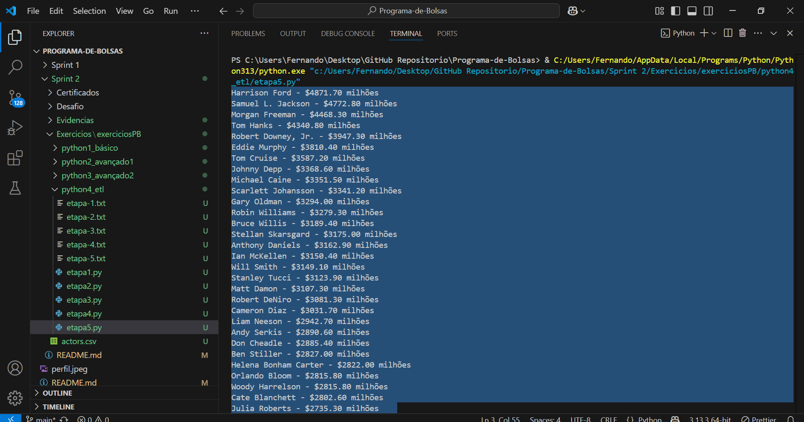
-