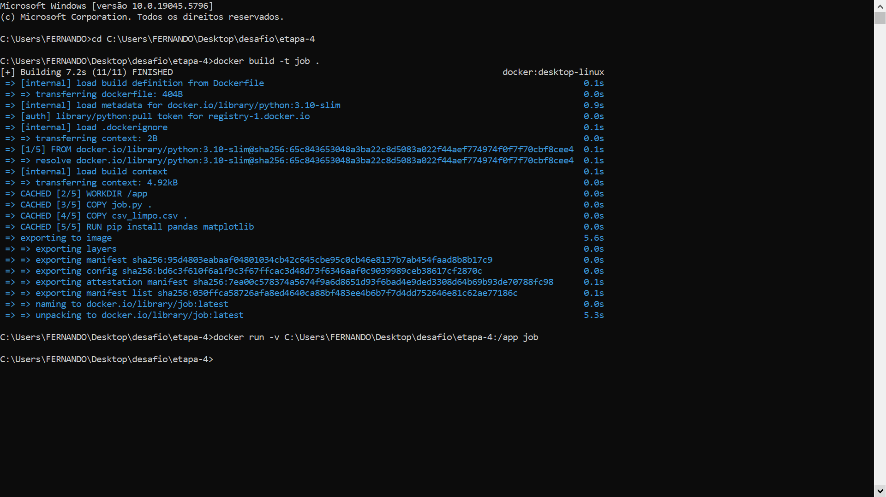

# Etapas


1. ... [Etapa I](etapa-1)

    Nessa etapa, pode-se perceber que com esse código no arquivo "etl.py":

    ```
    # Importa as bibliotecas necessárias
    import pandas as pd
    import re

    # Lê o CSV original usando pandas
    df = pd.read_csv("Programa-de-Bolsas/Sprint 3/Desafio/etapa-1/concert_tours_by_women.csv")

    # Renomeia a coluna "Adjustedgross (in 2022 dollars)" para "Adjusted gross (in 2022 dollars)"
    df.rename(columns={"Adjustedgross (in 2022 dollars)": "Adjusted gross (in 2022 dollars)"}, inplace=True)

    # Remove [qualquer coisa]
    df["Tour title"] = df["Tour title"].apply(lambda x: re.sub(r'\[.*?\]', '', x))
    # Remove tudo que não for letra, numero ou espaço
    df["Tour title"] = df["Tour title"].apply(lambda x: re.sub(r'[^\w\s]', '', x))
    # Normaliza múltiplos espaços
    df["Tour title"] = df["Tour title"].apply(lambda x: re.sub(r'\s+', ' ', x).strip())

    # Converte valores monetários para float (removendo $, vírgulas e letras)
    def limpar_e_converter(valor):
        valor_str = re.sub(r'[^\d.]', '', str(valor))
        return float(valor_str)

    # Separa as colunas que são consideradas como monetárias
    colunas_monetarias = [
        "Actual gross",
        "Adjusted gross (in 2022 dollars)",
        "Average gross"
    ]

    # Aplica a função às três colunas monetárias
    for col in colunas_monetarias:
        df[col] = df[col].apply(limpar_e_converter)

    # Extrai "Start year" e "End year" da coluna "Year(s)"
    def extrair_anos(anos):
        if "-" in anos: # Para apenas as células que contém a pontuação '-'
            partes = anos.split("-") # Separa em 2 partes, antes e depois da pontuação '-'
            return pd.Series([int(partes[0]), int(partes[1])]) # Retorna os respectivos anos às colunas
        else: # Para apenas as células que não contém a pontuação '-'
            return pd.Series([int(anos), int(anos)]) # Retorna o mesmo ano para ambas as colunas
        
    # Aplica a função à coluna "Year(s)"
    df[["Start year", "End year"]] = df["Year(s)"].apply(extrair_anos)

    # Seleciona as colunas que devem aparecer no Dataframe limpo
    colunas_importantes = [
        "Rank",
        "Actual gross",
        "Adjusted gross (in 2022 dollars)",
        "Artist",
        "Tour title",
        "Shows",
        "Average gross",
        "Start year",
        "End year"
    ]

    # Cria um novo Dataframe limpo baseado nas colunas preestabelecidas
    df = df[colunas_importantes]

    # Imprime o Dataframe limpo
    print(df)

    # Salva o DataFrame limpo em um novo arquivo CSV.
    df.to_csv("Programa-de-Bolsas/Sprint 3/Desafio/etapa-1/csv_limpo.csv", index=False)
    ```

    Foi criado o arquivo "csv_limpo.csv", como mostra esse antes e depois, respectivamente:

    

    

    E este é o conteúdo do arquivo "csv_limpo.csv":

    
---

2. ... [Etapa II](etapa-2)

    Nessa etapa, pode-se perceber que com esse código no arquivo "job.py":

    ```
    # Importa as bibliotecas necessárias
    import pandas as pd
    import matplotlib.pyplot as plt

    # Lê o CSV original usando pandas
    df = pd.read_csv("Programa-de-Bolsas/Sprint 3/Desafio/etapa-1/csv_limpo.csv")

    # Q1 ---------------------------------------

    # Conta quantas vezes cada artista aparece
    contagem_artistas = df["Artist"].value_counts()

    # Encontra o maior número de aparições
    max_aparicoes = contagem_artistas.max()

    # Obtem os artistas com esse número de aparições
    artistas_mais_frequentes = contagem_artistas[contagem_artistas == max_aparicoes].index.tolist()

    # Filtrar o DataFrame com esses artistas
    df_filtrado = df[df["Artist"].isin(artistas_mais_frequentes)]

    # Calcula a média do faturamento bruto (Actual gross) para esses artistas
    media_artistas = df_filtrado.groupby("Artist")["Actual gross"].mean()

    # Montar o DataFrame final com as colunas solicitadas
    df_colunas = pd.DataFrame({
        "Artist": media_artistas.index,
        "Appearances": contagem_artistas[media_artistas.index].values,
        "Average Actual Gross": media_artistas.values
    })

    # Ordena pela média de faturamento bruto e mostra o artista no topo
    df_ordenado = df_colunas.sort_values(by="Average Actual Gross", ascending=False).head(1)

    # Redefine os índices
    df1 = df_ordenado.reset_index(drop=True)

    # Q2 ---------------------------------------

    # Filtra turnês que aconteceram em apenas um ano
    tour_um_ano = df[df["Start year"] == df["End year"]]

    # Ordena pela média de faturamento bruto em ordem decrescente
    tours_ordenados = tour_um_ano.sort_values(by="Average gross", ascending=False)

    # Seleciona a primeira linha (maior média)
    top_tour_um_ano = tours_ordenados.head(1)

    # Redefine os índices
    df2 = top_tour_um_ano.reset_index(drop=True)

    # Q3 ---------------------------------------

    # Cria nova coluna com o valor ajustado por show
    df["Adjusted gross per show"] = df["Adjusted gross (in 2022 dollars)"] / df["Shows"]

    # Ordena os dados com base nessa nova coluna, do maior para o menor
    ordenado = df.sort_values(by="Adjusted gross per show", ascending=False)

    # Seleciona os 3 primeiros
    top_3 = ordenado.head(3)

    # Seleciona as colunas relevantes: Artista, Turnê e o lucro por show
    df3 = top_3[["Artist", "Tour title", "Adjusted gross per show"]]

    # Redefine os índices
    df3 = df3.reset_index(drop=True)

    # Exporta para um arquivo txt seguindo o padrão preestabelecido
    with open("Programa-de-Bolsas/Sprint 3/Desafio/etapa-2/respostas.txt", "w", encoding="utf-8") as f:
        f.write("Q1:\n\n")
        f.write(df1.to_string(index=False))
        f.write("\n\nQ2:\n\n")
        f.write(df2.to_string(index=False))
        f.write("\n\nQ3:\n\n")
        f.write(df3.to_string(index=False))

    # Q4 ---------------------------------------

    # Calcula somatório do faturamento bruto por artista
    somatorio_faturamento_bruto = df.groupby("Artist")["Actual gross"].sum()

    # Interseção: artista que mais aparece e tem maior somatório
    artista_mais_frequente = contagem_artistas.idxmax()
    artista_maior_somatorio = somatorio_faturamento_bruto.idxmax()

    # Se forem diferentes, pega a que atende ambos critérios
    if artista_mais_frequente == artista_maior_somatorio:
        artista_alvo = artista_mais_frequente
    else:
        # Filtra entre os que mais aparecem, qual tem maior soma
        max_aparicoes
        top_artistas = contagem_artistas[contagem_artistas == max_aparicoes].index
        artista_alvo = somatorio_faturamento_bruto[top_artistas].idxmax()

    # Filtra turnês da artista escolhida
    artista_df = df[df["Artist"] == artista_alvo]

    # Agrupa por ano e soma o faturamento
    faturamento_por_ano = artista_df.groupby("Start year")["Actual gross"].sum()

    # Plota gráfico de linhas
    plt.figure(figsize=(10, 5))
    plt.plot(faturamento_por_ano.index, faturamento_por_ano.values, marker='o', color='purple')
    plt.title(f'Faturamento por ano das turnês de {artista_alvo}')
    plt.xlabel("Ano de Início da Turnê")
    plt.ylabel("Faturamento Bruto (Actual gross)")
    plt.grid(True)
    plt.tight_layout()
    plt.savefig("Programa-de-Bolsas/Sprint 3/Desafio/etapa-2/Q4.png")  # <<< Exporta para PNG
    plt.close()

    # Q5 ---------------------------------------

    # Agrupa por artista e somar o número total de shows
    shows_por_artista = df.groupby("Artist")["Shows"].sum()

    # Ordena os artistas pelo total de shows (do maior para o menor)
    top_5_shows = shows_por_artista.sort_values(ascending=False).head(5)

    # Cria o gráfico de colunas com matplotlib
    plt.figure(figsize=(10, 6))  # Define o tamanho da figura
    plt.bar(top_5_shows.index, top_5_shows.values, color="skyblue")

    # Adiciona título e rótulos
    plt.title("Top 5 artistas com mais shows")
    plt.xlabel("Artista")
    plt.ylabel("Total de Shows")
    plt.xticks(rotation=45)  # Rotaciona os nomes para melhor visualização
    plt.tight_layout()
    plt.grid(axis='y', linestyle='--', alpha=0.7)
    plt.savefig("Programa-de-Bolsas/Sprint 3/Desafio/etapa-2/Q5.png")  # <<< Exporta para PNG
    plt.close()
    ```

    Foram criados os arquivos "respostas.txt", "Q4.png" e "Q5.png", como mostra esse antes e depois, respectivamente:

    

    

    E estes são os conteúdos dos arquivos "respostas.txt", "Q4.png" e "Q5.png", respectivamente:

    

    

    
---

3. ... [Etapa III](etapa-3)

    Nessa etapa, pode-se perceber que com esse código no arquivo "etl.py":

    ```
    # Importa as bibliotecas necessárias
    import pandas as pd
    import re

    # Lê o CSV original usando pandas
    df = pd.read_csv("concert_tours_by_women.csv")

    # Renomeia a coluna "Adjustedgross (in 2022 dollars)" para "Adjusted gross (in 2022 dollars)"
    df.rename(columns={"Adjustedgross (in 2022 dollars)": "Adjusted gross (in 2022 dollars)"}, inplace=True)

    # Remove [qualquer coisa]
    df["Tour title"] = df["Tour title"].apply(lambda x: re.sub(r'\[.*?\]', '', x))
    # Remove tudo que não for letra, numero ou espaço
    df["Tour title"] = df["Tour title"].apply(lambda x: re.sub(r'[^\w\s]', '', x))
    # Normaliza múltiplos espaços
    df["Tour title"] = df["Tour title"].apply(lambda x: re.sub(r'\s+', ' ', x).strip())

    # Converte valores monetários para float (removendo $, vírgulas e letras)
    def limpar_e_converter(valor):
        valor_str = re.sub(r'[^\d.]', '', str(valor))
        return float(valor_str)

    # Separa as colunas que são consideradas como monetárias
    colunas_monetarias = [
        "Actual gross",
        "Adjusted gross (in 2022 dollars)",
        "Average gross"
    ]

    # Aplica a função às três colunas monetárias
    for col in colunas_monetarias:
        df[col] = df[col].apply(limpar_e_converter)

    # Extrai "Start year" e "End year" da coluna "Year(s)"
    def extrair_anos(anos):
        if "-" in anos: # Para apenas as células que contém a pontuação '-'
            partes = anos.split("-") # Separa em 2 partes, antes e depois da pontuação '-'
            return pd.Series([int(partes[0]), int(partes[1])]) # Retorna os respectivos anos às colunas
        else: # Para apenas as células que não contém a pontuação '-'
            return pd.Series([int(anos), int(anos)]) # Retorna o mesmo ano para ambas as colunas
        
    # Aplica a função à coluna "Year(s)"
    df[["Start year", "End year"]] = df["Year(s)"].apply(extrair_anos)

    # Seleciona as colunas que devem aparecer no Dataframe limpo
    colunas_importantes = [
        "Rank",
        "Actual gross",
        "Adjusted gross (in 2022 dollars)",
        "Artist",
        "Tour title",
        "Shows",
        "Average gross",
        "Start year",
        "End year"
    ]

    # Cria um novo Dataframe limpo baseado nas colunas preestabelecidas
    df = df[colunas_importantes]

    # Imprime o Dataframe limpo
    print(df)

    # Salva o DataFrame limpo em um novo arquivo CSV.
    df.to_csv("csv_limpo.csv", index=False)
    ```

    Juntamente com esse código no arquivo Dockerfile:

    ```
    # Usa uma imagem base do Python
    FROM python:3.11-slim

    # Define o diretório de trabalho dentro do container
    WORKDIR /app

    # Copia o script e o CSV para o diretório de trabalho
    COPY etl.py .
    COPY concert_tours_by_women.csv .

    # Instala o pandas
    RUN pip install --no-cache-dir pandas

    # Executa o script Python
    CMD ["python", "etl.py"]
    ```

    Sendo executados no Prompt de Comandos da seguinte forma:

    
    
    Imagens de como ficou no Docker Desktop:

    

    

    Foi criado o arquivo "csv_limpo.csv", como mostra esse antes e depois, respectivamente:

    

    

    E este é o conteúdo do arquivo "csv_limpo.csv":

    
---

4. ... [Etapa IV](etapa-4)

    Nessa etapa, pode-se perceber que com esse código no arquivo "job.py":

    ```
    # Importa as bibliotecas necessárias
    import pandas as pd
    import matplotlib.pyplot as plt

    # Lê o CSV original usando pandas
    df = pd.read_csv("csv_limpo.csv")

    # Q1 ---------------------------------------

    # Conta quantas vezes cada artista aparece
    contagem_artistas = df["Artist"].value_counts()

    # Encontra o maior número de aparições
    max_aparicoes = contagem_artistas.max()

    # Obtem os artistas com esse número de aparições
    artistas_mais_frequentes = contagem_artistas[contagem_artistas == max_aparicoes].index.tolist()

    # Filtrar o DataFrame com esses artistas
    df_filtrado = df[df["Artist"].isin(artistas_mais_frequentes)]

    # Calcula a média do faturamento bruto (Actual gross) para esses artistas
    media_artistas = df_filtrado.groupby("Artist")["Actual gross"].mean()

    # Montar o DataFrame final com as colunas solicitadas
    df_colunas = pd.DataFrame({
        "Artist": media_artistas.index,
        "Appearances": contagem_artistas[media_artistas.index].values,
        "Average Actual Gross": media_artistas.values
    })

    # Ordena pela média de faturamento bruto e mostra o artista no topo
    df_ordenado = df_colunas.sort_values(by="Average Actual Gross", ascending=False).head(1)

    # Redefine os índices
    df1 = df_ordenado.reset_index(drop=True)

    # Q2 ---------------------------------------

    # Filtra turnês que aconteceram em apenas um ano
    tour_um_ano = df[df["Start year"] == df["End year"]]

    # Ordena pela média de faturamento bruto em ordem decrescente
    tours_ordenados = tour_um_ano.sort_values(by="Average gross", ascending=False)

    # Seleciona a primeira linha (maior média)
    top_tour_um_ano = tours_ordenados.head(1)

    # Redefine os índices
    df2 = top_tour_um_ano.reset_index(drop=True)

    # Q3 ---------------------------------------

    # Cria nova coluna com o valor ajustado por show
    df["Adjusted gross per show"] = df["Adjusted gross (in 2022 dollars)"] / df["Shows"]

    # Ordena os dados com base nessa nova coluna, do maior para o menor
    ordenado = df.sort_values(by="Adjusted gross per show", ascending=False)

    # Seleciona os 3 primeiros
    top_3 = ordenado.head(3)

    # Seleciona as colunas relevantes: Artista, Turnê e o lucro por show
    df3 = top_3[["Artist", "Tour title", "Adjusted gross per show"]]

    # Redefine os índices
    df3 = df3.reset_index(drop=True)

    # Exporta para um arquivo txt seguindo o padrão preestabelecido
    with open("respostas.txt", "w", encoding="utf-8") as f:
        f.write("Q1:\n\n")
        f.write(df1.to_string(index=False))
        f.write("\n\nQ2:\n\n")
        f.write(df2.to_string(index=False))
        f.write("\n\nQ3:\n\n")
        f.write(df3.to_string(index=False))

    # Q4 ---------------------------------------

    # Calcula somatório do faturamento bruto por artista
    somatorio_faturamento_bruto = df.groupby("Artist")["Actual gross"].sum()

    # Interseção: artista que mais aparece e tem maior somatório
    artista_mais_frequente = contagem_artistas.idxmax()
    artista_maior_somatorio = somatorio_faturamento_bruto.idxmax()

    # Se forem diferentes, pega a que atende ambos critérios
    if artista_mais_frequente == artista_maior_somatorio:
        artista_alvo = artista_mais_frequente
    else:
        # Filtra entre os que mais aparecem, qual tem maior soma
        max_aparicoes
        top_artistas = contagem_artistas[contagem_artistas == max_aparicoes].index
        artista_alvo = somatorio_faturamento_bruto[top_artistas].idxmax()

    # Filtra turnês da artista escolhida
    artista_df = df[df["Artist"] == artista_alvo]

    # Agrupa por ano e soma o faturamento
    faturamento_por_ano = artista_df.groupby("Start year")["Actual gross"].sum()

    # Plota gráfico de linhas
    plt.figure(figsize=(10, 5))
    plt.plot(faturamento_por_ano.index, faturamento_por_ano.values, marker='o', color='purple')
    plt.title(f'Faturamento por ano das turnês de {artista_alvo}')
    plt.xlabel("Ano de Início da Turnê")
    plt.ylabel("Faturamento Bruto (Actual gross)")
    plt.grid(True)
    plt.tight_layout()
    plt.savefig("Q4.png")  # <<< Exporta para PNG
    plt.close()

    # Q5 ---------------------------------------

    # Agrupa por artista e somar o número total de shows
    shows_por_artista = df.groupby("Artist")["Shows"].sum()

    # Ordena os artistas pelo total de shows (do maior para o menor)
    top_5_shows = shows_por_artista.sort_values(ascending=False).head(5)

    # Cria o gráfico de colunas com matplotlib
    plt.figure(figsize=(10, 6))  # Define o tamanho da figura
    plt.bar(top_5_shows.index, top_5_shows.values, color="skyblue")

    # Adiciona título e rótulos
    plt.title("Top 5 artistas com mais shows")
    plt.xlabel("Artista")
    plt.ylabel("Total de Shows")
    plt.xticks(rotation=45)  # Rotaciona os nomes para melhor visualização
    plt.tight_layout()
    plt.grid(axis='y', linestyle='--', alpha=0.7)
    plt.savefig("Q5.png")  # <<< Exporta para PNG
    plt.close()
    ```

    Juntamente com esse código no arquivo Dockerfile:

    ```
    # Usa imagem base com Python
    FROM python:3.10-slim

    # Define diretório de trabalho no container
    WORKDIR /app

    # Copia os arquivos do host para o container
    COPY job.py .
    COPY csv_limpo.csv .

    # Instala as dependências necessárias
    RUN pip install pandas matplotlib

    # Executa o script quando o container roda
    CMD ["python", "job.py"]
    ```

    Sendo executados no Prompt de Comandos da seguinte forma:

    

    Imagens de como ficou no Docker Desktop:

    

    
    
    Foram criados os arquivos "respostas.txt", "Q4.png" e "Q5.png", como mostra esse antes e depois, respectivamente:

    

    

    E estes são os conteúdos dos arquivos "respostas.txt", "Q4.png" e "Q5.png", respectivamente:

    

    

    
---

5. ... [Etapa V](etapa-5)

    Nessa etapa, pode-se perceber que com esse código no arquivo "docker-compose.yml":

    ```
    version: "3.8"

    services:
    etl-service:
        build:
        context: ./etl              # Usa o Dockerfile da pasta etl
        container_name: etl-container            # Cria um nome para o container
        working_dir: /app            # Define o diretório padrão do container
        command: ["python", "etl.py"]     # Executa o script etl.py
        volumes:
        - ./volume:/app/volume          # Monta a pasta local ./volume no caminho /app/volume do container

    job-service:
        build:
        context: ./job                # Usa o Dockerfile da pasta job
        container_name: job-container            # Cria um nome para o container
        working_dir: /app            # Define o diretório padrão do container
        command: ["python", "job.py"]     # Executa o app que usa o CSV limpo
        volumes:
        - ./volume:/app/volume          # Monta a pasta local ./volume no caminho /app/volume do container
        depends_on:
        - etl-service                   # Garante que o etl rode antes do job
    ```

    Sendo executado no Prompt de Comandos da seguinte forma:

    

    Imagens de como ficou no Docker Desktop:

    

    
    
    Dentro do arquivo "volume", foram criados os arquivos "csv_limpo.csv", "respostas.txt", "Q4.png" e "Q5.png", como mostra esse antes e depois, respectivamente:

    

    

    E estes são os conteúdos dos arquivos "csv_limpo.csv", "respostas.txt", "Q4.png" e "Q5.png", respectivamente:

    

    

    

    
---
