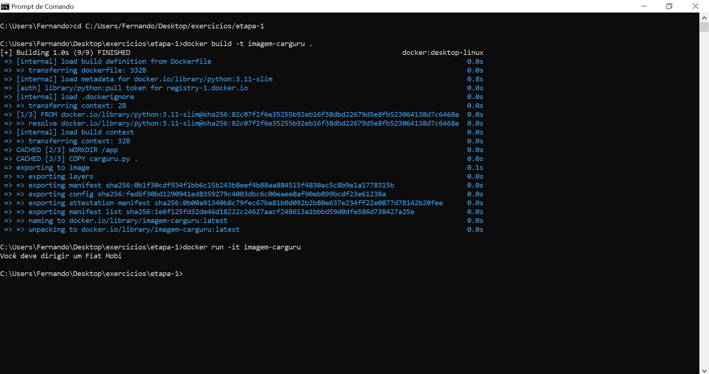
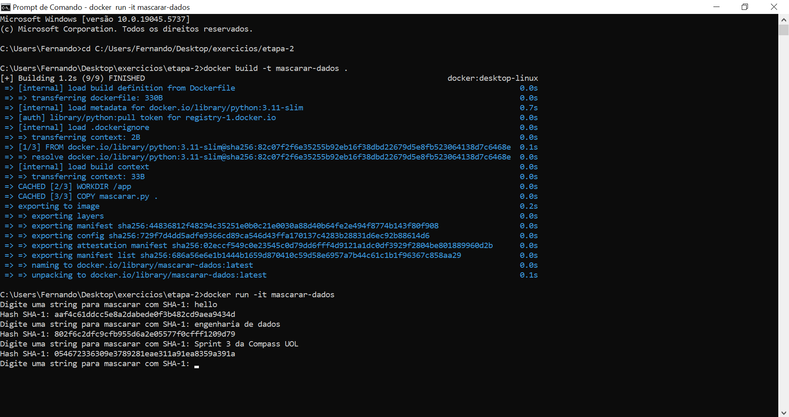
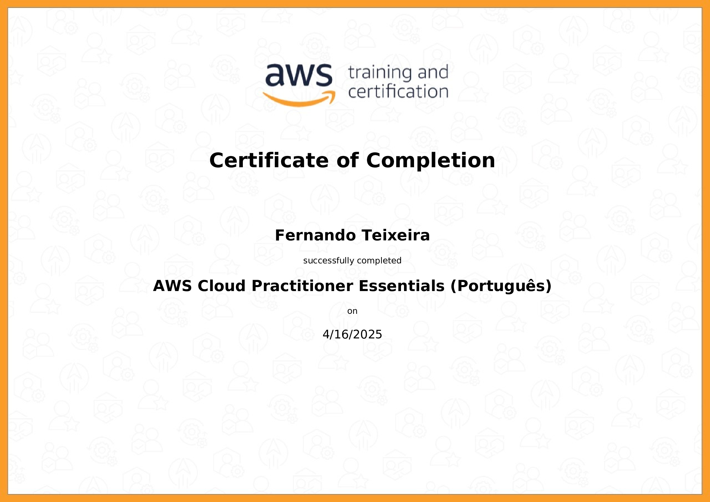

# Resumo

**Docker:** 
1. Aprendi os fundamentos do Docker

    • O que são contêineres, como funcionam e por que são úteis no desenvolvimento e na produção.

    • Como instalar e configurar o Docker em diferentes sistemas operacionais.

    • Executar, parar e remover contêineres.

2. Aprendi a criação e gerenciamento de contêineres

    • Como rodar aplicações isoladas em contêineres Docker.

    • Escrever arquivos Dockerfile, construir imagens personalizadas e otimizar camadas.

    • Persistência de dados com volumes e uso prático em aplicações reais.

    • Montar diretórios do host no contêiner para facilitar o desenvolvimento e depuração.

3. Aprendi sobre redes no Docker

    • Isolamento e comunicação entre contêineres por meio de redes personalizadas.

    • Bridge, host, overlay, e suas aplicações práticas.

4. Aprendi Docker Compose

    • Definir e executar aplicações multi-contêiner com arquivos docker-compose.yml.

    • Subir, parar e escalar serviços com comandos Compose.

5. Aprendi sobre a orquestração de Contêineres

    • Criar clusters, gerenciar nós e serviços distribuídos.

    • Deploy de aplicações em nuvem com alta disponibilidade.

    • Fundamentos do Kubernetes, seus componentes principais (pods, services, deployments, etc.).

    • Diferenças entre aplicar configurações com kubectl direto vs arquivos de manifesto.

    • Comparações entre Docker Swarm e Kubernetes, cenários de uso e boas práticas.

7. Aprendi sobre YAML do Básico ao Avançado

    • Escrever arquivos YAML de forma correta e organizada.

    • Uso de YAML para Docker Compose e Kubernetes.

    • Organização, reutilização e manutenção de arquivos YAML em projetos de infraestrutura.

# Exercícios

1. ...
[Resposta Python do Exercício(Etapa-1).](./Exercicios/etapa-1/carguru.py)

2. ...
[Resposta Dockerfile do Exercício(Etapa-1).](./Exercicios/etapa-1/Dockerfile)

3. ...
[Resposta Python do Exercício(Etapa-2).](./Exercicios/etapa-2/mascarar.py)

4. ...
[Resposta Dockerfile do Exercício(Etapa-1).](./Exercicios/etapa-2/Dockerfile)

# Evidências

Ao executar o código do exercício 1 no Prompt de Comando juntamente com os comandos do Docker, o resultado correto foi obtido com sucesso conforme podemos ver na imagem a seguir:

-

Ao executar o código do exercício 2 no Prompt de Comando juntamente com os comandos do Docker, o resultado correto foi obtido com sucesso conforme podemos ver na imagem a seguir:

# Certificados

Certificado do Curso AWS Cloud Practitioner Essentials (Português)

