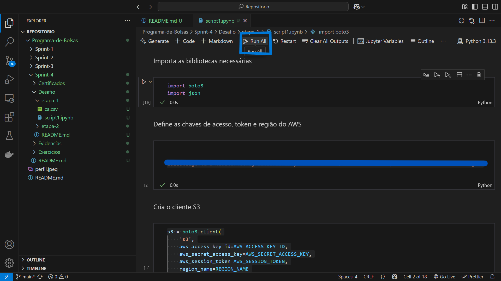
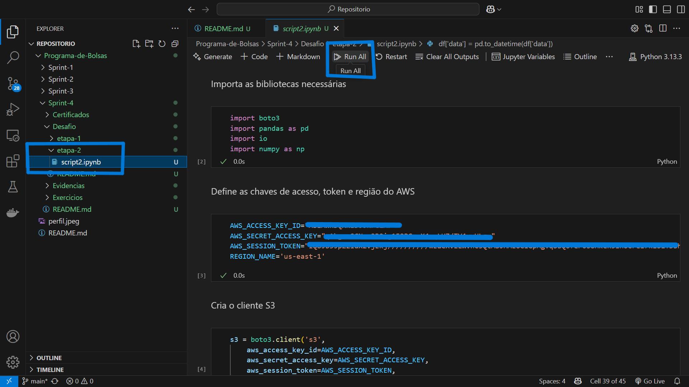
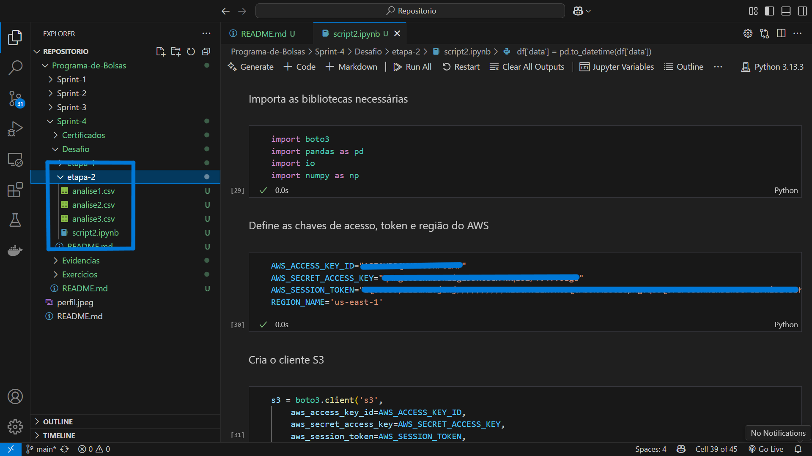

# Etapas


1. ... [Etapa I](etapa-1)

    <b>Criação e Configuração de Bucket S3 com Acesso Público via Python.</b>

    <h3>Objetivo:</h3>
    ⁃ O objetivo deste script é automatizar a criação de um bucket S3 na AWS, configurar suas permissões para permitir acesso público de leitura, e realizar o upload de um arquivo CSV para esse bucket.

    <h3>Etapas Executadas no Script:</h3>
    ⁃ Autenticação com a AWS:

    O script inicia criando um cliente boto3 com credenciais temporárias (Access Key, Secret Key e Session Token).
    
    ⁃ Criação do Bucket

    O bucket é criado com o nome "programa-de-bolsas-fernando". Não são passadas configurações adicionais de região, pois o código já define us-east-1 como região padrão.

    ```
    s3.create_bucket(Bucket=bucket_name)
    ```

    ⁃ Desbloqueio do Acesso Público:

    Por padrão, a AWS bloqueia todo acesso público em novos buckets. Para permitir leitura pública dos objetos via URL, essas configurações precisam ser desativadas:

    ```
    s3.put_public_access_block(
    Bucket=bucket_name,
    PublicAccessBlockConfiguration={
        'BlockPublicAcls': False,
        'IgnorePublicAcls': False,
        'BlockPublicPolicy': False,
        'RestrictPublicBuckets': False
        }
    )
    ```

    ⁃ Definição de Política Pública de Leitura:

    Uma política do tipo "s3:GetObject" é aplicada ao bucket para permitir que qualquer pessoa (Principal: "*") leia os objetos públicos.

    ```
    s3.put_bucket_policy(
    Bucket=bucket_name,
    Policy=json.dumps({
        "Version": "2012-10-17",
        "Statement": [{
            "Effect": "Allow",
            "Principal": "*",
            "Action": "s3:GetObject",
            "Resource": f"arn:aws:s3:::{bucket_name}/*"
            }]
        })
    )
    ```

    ⁃ Upload do Arquivo CSV
    O script realiza o upload do arquivo ca.csv, localizado localmente no caminho:

    ```
    ca.csv
    ```

    para o bucket com o nome "etapa1/ca.csv".

    ```
    s3.upload_file(Filename=arquivo_local, Bucket=bucket_name, Key=objeto_s3)
    ```

    <h3>Requisitos:</h3>
    ⁃ Python 3.x

    ⁃ Bibliotecas:
    <i>boto3 / json</i>

    Instale com:

    ```
    pip install boto3
    ```

    <h3>Considerações de Segurança:</h3>

    ⁃ Este script usa credenciais diretamente no código, o que não é recomendado em ambientes de produção, apenas para este fim educacional.

    ⁃ Prefira usar perfis com aws configure ou variáveis de ambiente.

    ⁃ Certifique-se de que o conteúdo enviado ao bucket público não contenha informações sensíveis.

    <h3>Evidências:</h3>
    ⁃ Os prints serão separados em antes e depois da execução do script.

    ⁃ Antes:

    Bucket vazio
    

    Execução do código
    

    ⁃ Depois:

    Bucket criado
    


    

    Arquivo "csv" dentro do bucket
    
---

2. ... [Etapas II e III](etapa-2)

    <b>Análise de Consultas Ambulatoriais com Pandas e Integração com AWS S3.</b>

    <h3>Objetivo:</h3>
    ⁃ Este script tem como objetivo realizar a extração, tratamento e análise de dados sobre consultas médicas ambulatoriais, armazenados em um bucket S3 da AWS. Após a análise, os resultados são exportados novamente para o S3. A abordagem aplicada combina manipulação de dados com pandas, integração com o serviço Amazon S3 via boto3 e geração de três análises com requisitos específicos.

    <h3>Etapas Executadas no Script:</h3>

    ⁃ Importação de bibliotecas:

    São importadas as bibliotecas boto3, pandas, io e numpy para integração com a AWS, manipulação de dados e tratamento de fluxos de arquivos.

    ⁃ Conexão com o S3:

    As credenciais temporárias da AWS são definidas para autenticar com segurança. Em seguida, é criado um cliente boto3 para acessar o bucket.

    O script se conecta ao bucket chamado "programa-de-bolsas-fernando" e lê o arquivo CSV armazenado na chave "etapa1/ca.csv".

    ⁃ Tratamento e limpeza dos dados:

    O DataFrame passa por uma série de transformações e limpezas para garantir consistência:

    • Conversão da coluna de data e hora (data_consulta) para tipo datetime.

    ```
    df['data_consulta'] = pd.to_datetime(df['data_consulta'], dayfirst=True, errors='coerce')
    ```

    • Criação de colunas separadas para data e hora.

    ```
    df['data'] = df['data_consulta'].dt.date
    df['hora'] = df['data_consulta'].dt.time
    ```

    • Remoção de valores nulos e espaços em branco.

    ```
    df = df.replace('', pd.NA) 
    df = df.dropna()
    ```

    • Conversão da coluna idade para tipo inteiro.

    ```
    df['idade'] = df['idade'].astype(int)
    ```

    Essas etapas garantem a integridade dos dados para análise estatística e agrupamentos.

    <h3>Análises Realizadas:</h3>

    ⁃ ANÁLISE 1 - Total de consultas de todo o período por especialidade para crianças e idosos do sexo feminino de todos os municípios da região Nordeste.

    Envolve uso de dois operadores lógicos "(&) e (|)" e uma função de agregação "(groupby + size())".

    ```
    filtro = (df['sexo'] == 'F') & ((df['idade'] <= 12) | (df['idade'] >= 60))
    analise1 = df[filtro].groupby('especialidade').size().reset_index(name='total_consultas')
    ```

    Resultado salvo como "analise1.csv" e enviado ao S3 na chave "etapa2/analise1.csv".

    ```
    analise1.to_csv("analise1.csv", index=False)
    arquivo_local = 'analise1.csv'     
    objeto_s3 = 'etapa2/analise1.csv'     
    s3.upload_file(
    Filename=arquivo_local,
    Bucket=bucket_name,
    Key=objeto_s3
    )
    ```

    ⁃ Análise 2: Conversão da idade para float e classificação por faixa etária de homens e mulheres de todo o período de todos os municípios da região Nordeste

    Utiliza uma função condicional "(np.where)" e uma função de conversão "(astype(float))".

    ```
    df['faixa'] = np.where(df['idade'] >= 18, 'maior de idade', 'menor de idade')
    df['idade_float'] = df['idade'].astype(float)
    analise2 = df[['idade', 'idade_float', 'faixa']]
    ```

    Resultado salvo como "analise2.csv" e enviado ao S3 na chave "etapa2/analise2.csv".

    ```
    arquivo_local = 'analise2.csv'  
    objeto_s3 = 'etapa2/analise2.csv'     
    s3.upload_file(
    Filename=arquivo_local,
    Bucket=bucket_name,
    Key=objeto_s3
    )
    ```

    ⁃ Análise 3: Consultas de março com especialidade contendo 'urologia' para homens e mulheres de todos os municípios da região Nordeste

    Envolve uma função de data "(dt.month)" e uma função de string "(str.strip())".

    ```
    df['data'] = pd.to_datetime(df['data'])
    df_marco_urologia = df[
    (df['data'].dt.month == 3) &
    (df['especialidade'].str.strip() == 'UROLOGIA')
    ].reset_index()
    analise3 = df_marco_urologia[['data', 'especialidade']]
    ```

    Resultado salvo como "analise2.csv" e enviado ao S3 na chave "etapa2/analise2.csv".

    ```
    arquivo_local = 'analise3.csv'  
    objeto_s3 = 'etapa2/analise3.csv'     
    s3.upload_file(
    Filename=arquivo_local,
    Bucket=bucket_name,
    Key=objeto_s3
    )
    ```

    <h3>Requisitos:</h3>

    ⁃ Python 3.x

    ⁃ Bibliotecas:
    <i>boto3 / io / pandas / numpy</i>

    Instale com:

    ```
    pip install boto3 pandas numpy
    ```

    <h3>Considerações de Finais:</h3>

    ⁃ Todas as transformações foram feitas considerando boas práticas de ETL: validação de tipos, limpeza de dados ausentes e separação de colunas compostas.

    ⁃ O uso de credenciais no código é temporário para testes para fins educacionais. Em produção, prefira variáveis de ambiente ou perfis com "aws configure".

    <h3>Evidências:</h3>
    ⁃ Os prints serão separados em antes e depois da execução do script.

    ⁃ Antes:

    

    Execução do código
    

    ⁃ Depois:

    

    

    Arquivos "csv" dentro do bucket
    