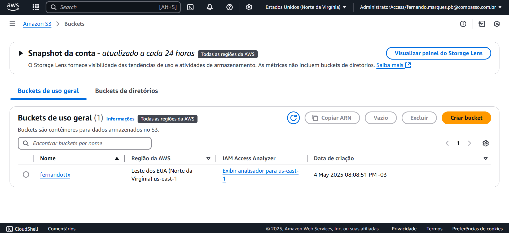
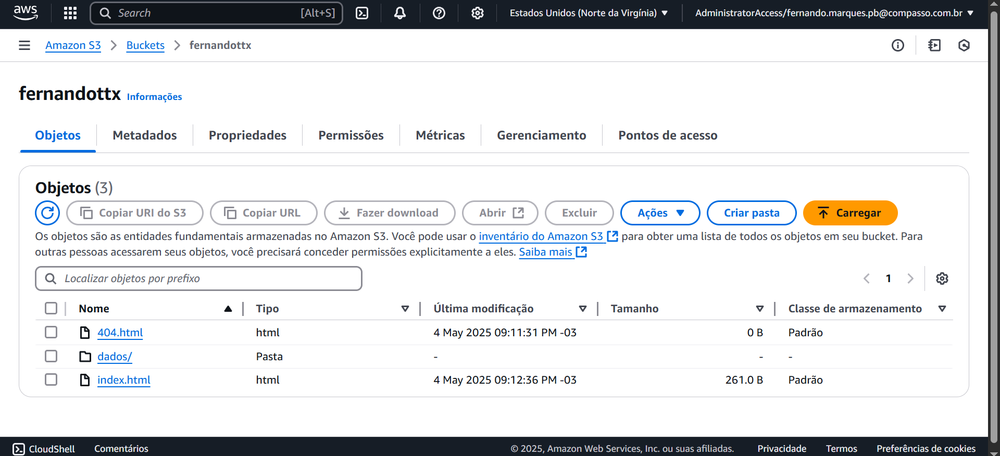
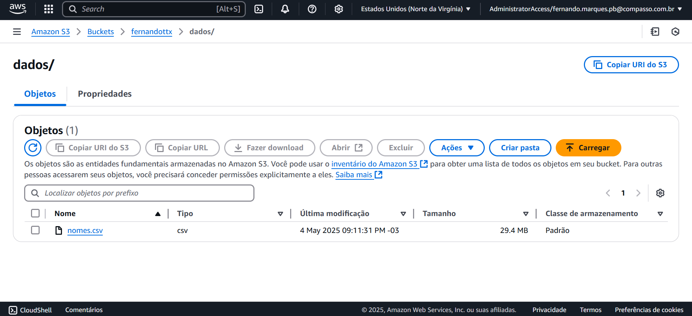
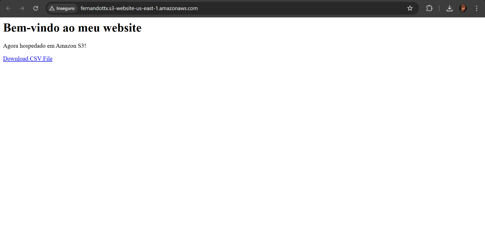
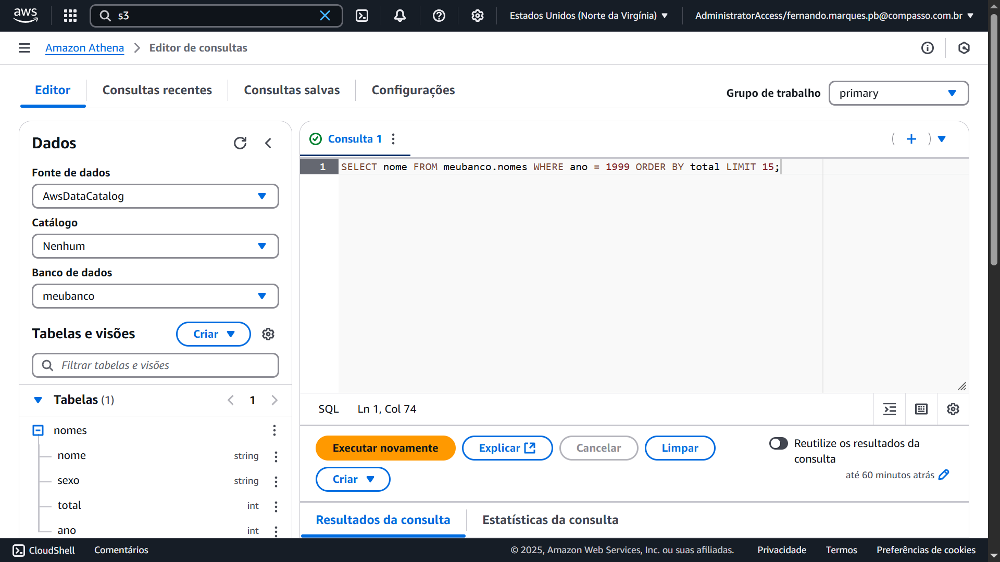
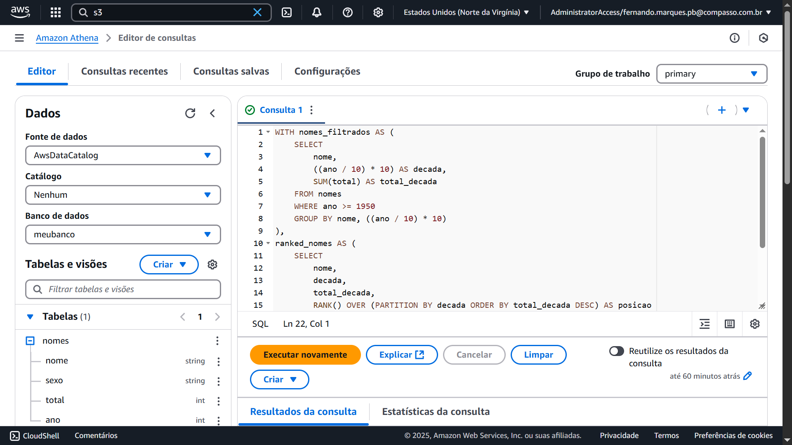
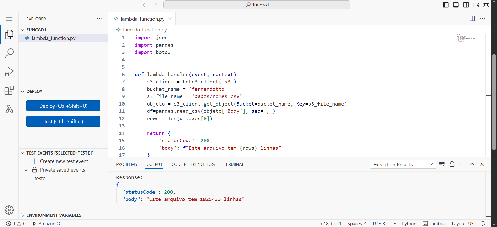
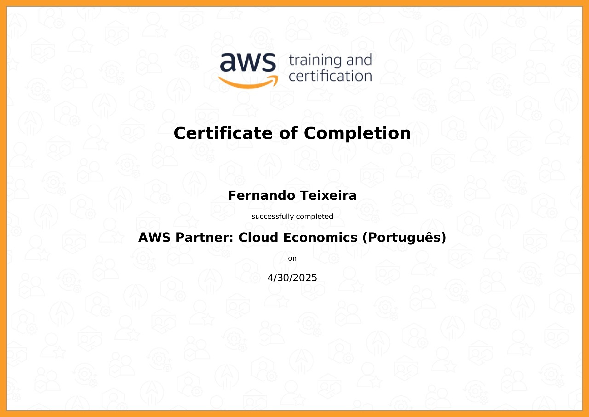
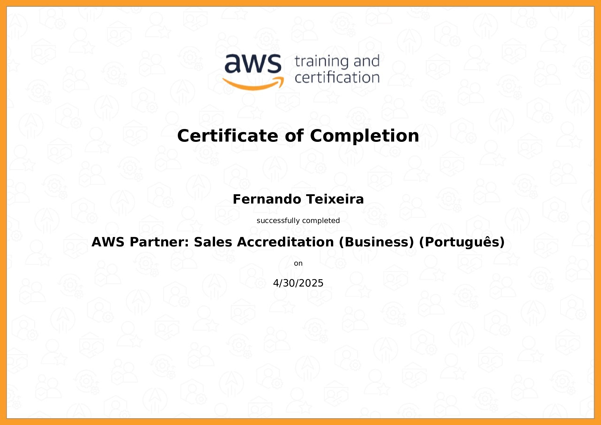
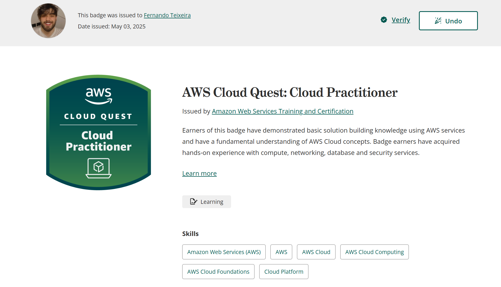

# Resumo

**Lab AWS S3:** 

<h3>Objetivo:</h3>

Este laboratório teve como foco mostrar os conceitos fundamentais do Amazon S3 (Simple Storage Service), explorando como criar buckets, fazer upload e download de arquivos e configurar permissões de acesso.

<h3>O que eu aprendi:</h3>

⁃ Criação de buckets S3 com "boto3" ou pela "AWS Console".

⁃ Upload e download de arquivos usando Python "(s3.upload_file, s3.download_file)".

⁃ Gerenciamento de permissões:

1. Configuração de políticas públicas.

2. Desbloqueio de acesso público "(put_public_access_block)".

⁃ Organização de arquivos com uso de "pastas" virtuais via Key.

⁃ Listagem de objetos, deleção e gerenciamento do conteúdo de buckets.

<h3>Aplicações práticas:</h3>

⁃ Armazenar datasets para análise.

⁃ Compartilhar arquivos entre sistemas e serviços.

⁃ Servir arquivos estáticos em sites ou aplicações web.

**Lab AWS Athena:** 

<h3>Objetivo:</h3>

Este laboratório teve como foco utilizar o Amazon Athena para consultar dados diretamente no S3 usando SQL, sem necessidade de um banco de dados tradicional.

<h3>O que eu aprendi:</h3>

⁃ Como organizar os dados no S3 para leitura por Athena (formato e partições).

⁃ Criação de tabela no Athena baseada em arquivos CSV.

⁃ Execução de queries SQL diretamente sobre arquivos no S3.

⁃ Integração com Python para automação das consultas "(via boto3)"

⁃ Análise rápida e exploratória sem mover os dados.

<h3>Aplicações práticas:</h3>

⁃ Query sob grandes volumes de dados no S3.

⁃ Integração com ferramentas como Amazon QuickSight.

⁃ Data Lake simples e de baixo custo.

**Lab AWS Lambda:** 

<h3>Objetivo:</h3>

Este laboratório teve como foco o funcionamento do AWS Lambda, mirando na criação de funções serverless que executam automaticamente em resposta a eventos.

<h3>O que eu aprendi:</h3>

⁃ Criação de funções Lambda via Console ou "boto3".

⁃ Configuração de gatilhos (eventos) como uploads no S3.

⁃ Integração com outros serviços AWS (S3, DynamoDB, etc.).

<h3>Aplicações práticas:</h3>

⁃ Processamento automático de arquivos enviados ao S3.

⁃ Limpeza, validação e transformação de dados sem servidores.

⁃ Automatização de pipelines de dados.

**Lab AWS Limpeza de Recursos:** 

<h3>Objetivo:</h3>

Este laboratório teve como foco orientar como limpar os recursos criados nas etapas anteriores para evitar custos desnecessários e manter o ambiente organizado.

<h3>O que eu aprendi:</h3>

⁃ Deletar arquivos e buckets S3.

⁃ Deletar tabelas e bancos de dados no Athena.

⁃ Encerrar funções Lambda que não estão mais em uso.

⁃ Boas práticas para evitar cobranças indesejadas (como partições em Athena não usadas)

<h3>Aplicações práticas:</h3>

⁃ Evitar consumo de recursos em projetos temporários.

⁃ Organizar o ambiente para novos ciclos de desenvolvimento.

# Evidências

**Lab AWS S3:** 

Criação do bucket

Arquivos "404.html", "dados/nomes.csv" e "index.html" dentro do bucket

Endpoint do site

#

**Lab AWS Athena:** 

[Código da 1º consulta solicitada](./Exercicios/2-lab_aws_athena/ex1.txt)

Teste dos dados

[Resultado da 1º consulta solicitada](./Exercicios/2-lab_aws_athena/consulta-1.csv)

[Código da 2º consulta solicitada](./Exercicios/2-lab_aws_athena/ex2.txt)

Teste dos dados

[Resultado da 2º consulta solicitada](./Exercicios/2-lab_aws_athena/consulta-2.csv)

#

**Lab AWS Lambda:** 

Criação da função lambda e execução do código usando uma layer, criada a partir de um arquivo Dockerfile

[Arquivo Dockerfile](./Exercicios/3-lab_aws_lambda/Dockerfile)

# Certificados

AWS Partner: Cloud Economics (Português)

AWS Partner: Sales Accreditation (Business) (Português)

AWS Skill Builder - AWS Cloud Quest: Cloud Practitioner

