# Etapas

1. ... [Etapa I](etapa-1)

    # Upload de Arquivos CSV para AWS S3 com Docker e Python.

    ## Objetivo:

    Ler dois arquivos CSV (`movies.csv` e `series.csv`) de um diretório local e realizar o upload para um bucket S3 na AWS sem aplicar filtros, organizando os arquivos segundo uma estrutura de data padronizada. O processo é executado dentro de um container Docker utilizando Python e a biblioteca `boto3`.

    ## Etapas Executadas no Script:

    ### Configure suas credenciais AWS:

    Se ainda não configurou, execute no terminal:

    ```
    aws configure
    ```
    
    ### Construa a imagem Docker

    No diretório do projeto:

    ```
    docker build -t s3-uploader .
    ```

    ### Execute o container Docker

    Para Windows (CMD):

    ```
    docker run -v %USERPROFILE%\.aws:/root/.aws -v %cd%\data:/app/data s3-uploader
    ```

    Para Linux/macOS:

    ```
    docker run -v $HOME/.aws:/root/.aws -v $(pwd)/data:/app/data s3-uploader
    ```

    ### Requisitos:
    
    - Docker instalado

    - Bucket S3 existente e permissões para `putObject`

    - Arquivos `movies.csv` e `series.csv` salvos na pasta `data/`

    - Conta AWS com credenciais configuradas (`aws configure`)
   
    ## Evidências:

    ### Os prints serão separados em antes e depois da execução do script.

    #### Antes:

    Sem buckets
    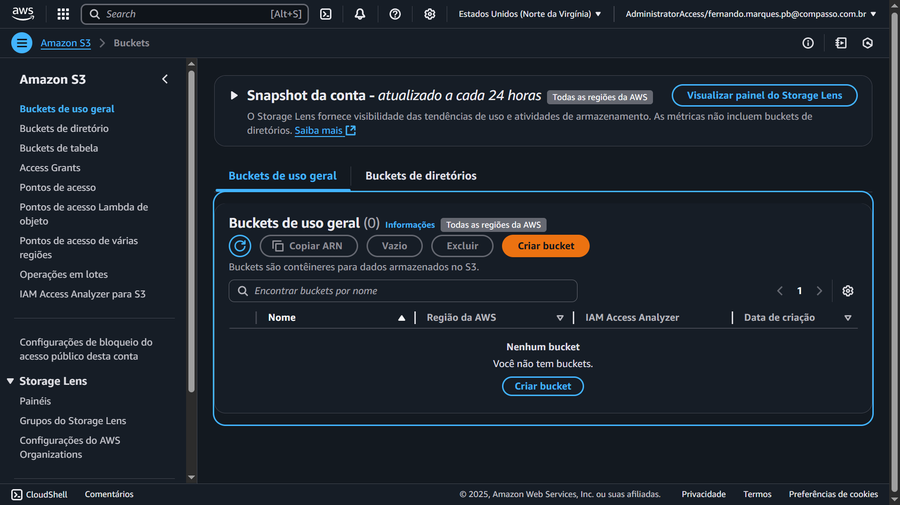

    Bucket criado
    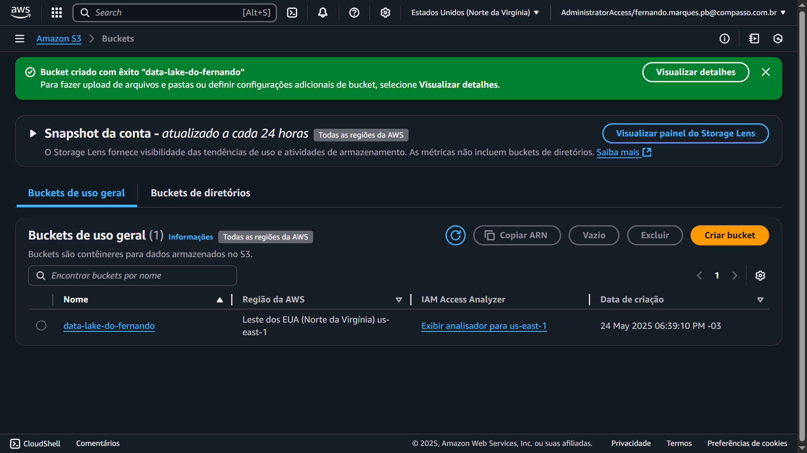

    Bucket vazio
    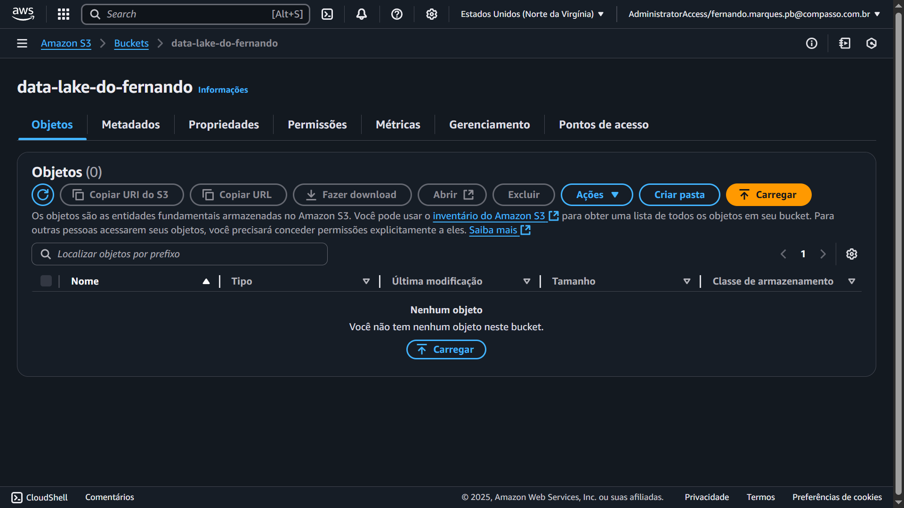

    Organização das pastas
    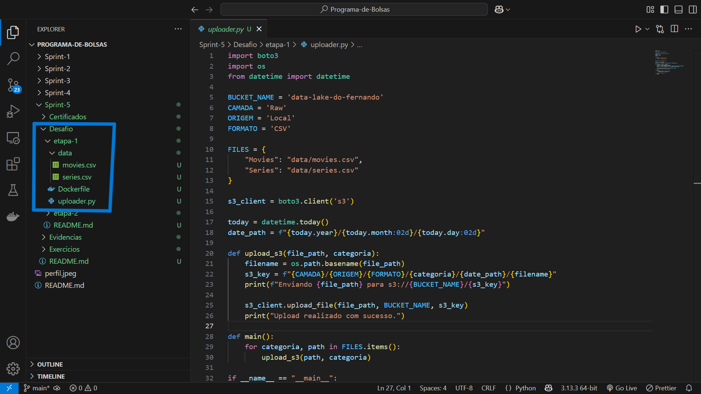

    Execução Docker
    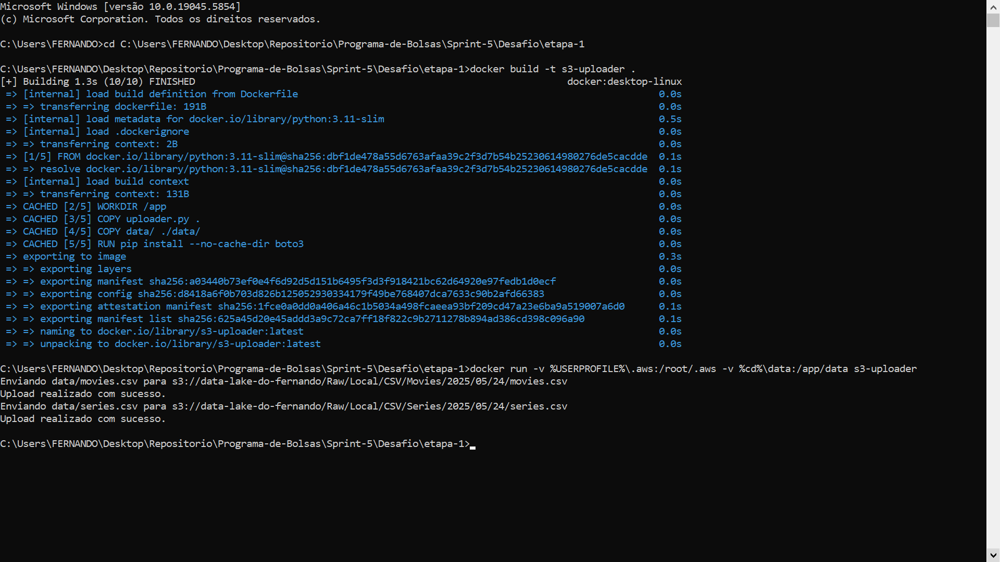

    #### Depois:

    Inserção do arquivo `movies.csv` ao bucket seguindo o caminho correto
    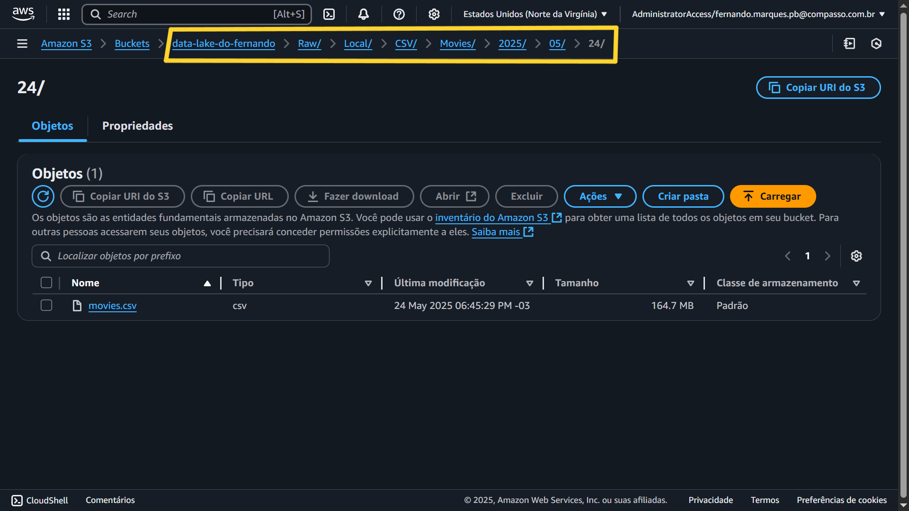

    Inserção do arquivo `series.csv` ao bucket seguindo o caminho correto
    


---

2. ... [Etapa II](etapa-2)

    # Coleta de Filmes com Temas de Crime e Guerra (TMDB + AWS Lambda).

    ## Objetivo:

    Realizar a coleta automatizada de dados de filmes com os temas **crime** e **guerra**, utilizando a **API do TMDB**, uma função **AWS Lambda** e armazenamento em **Amazon S3** na camada **Raw Zone**, no formato **JSON**.

    ## Tecnologias Utilizadas

    - Python 3.10
    - AWS Lambda
    - Amazon S3
    - Requests (via Lambda Layer)
    - Boto3
    - TMDB API
        
    ## Análises Suportadas

    A coleta foi estruturada para fornecer base para as seguintes análises no contexto de filmes de crime/guerra:

    1. Evolução Temporal de Filmes de Crime/Guerra
    2. Comparativo: Antes, Durante e Depois de Grandes Guerras
    3. Distribuição Geográfica da Produção de Filmes
    4. Principais Atores e Diretores em Filmes de Crime/Guerra
    5. Filmes com Temas de Guerra/Crime Mais Bem Avaliados pelo Público
    6. Comparativo de Popularidade e Avaliação por Período Histórico
    7. Representatividade Feminina em Filmes de Crime/Guerra
    8. Evolução do Orçamento Médio dos Filmes
    9. Duração Média dos Filmes e Mudança ao Longo do Tempo

    ## Funcionamento da Lambda

    Faz chamadas paginadas à API do TMDB entre os anos de 1900 a 2000.

    Coleta dados detalhados e créditos dos filmes cujo **primeiro gênero** seja `crime (80)` ou `guerra (10752)`.

    Empacota os dados em lotes de até 100 registros.

    Salva os arquivos JSON no Amazon S3.

    ## Estrutura dos Dados Coletados

    Cada filme contém os seguintes campos:

    - `id`, `titulo`, `data_lancamento`, `descricao`
    - `genero_principal`, `generos`, `nota_media`, `total_votos`, `popularidade`
    - `duracao`, `orcamento`, `receita`
    - `idiomas_falados`, `paises_producao`, `empresas_producao`, `colecao`
    - `diretor`, `atores_principais`, `genero_feminino_presente`

    ## 🧱 Lambda Layer (Requisitos)

    Crie uma **Lambda Layer** contendo a biblioteca `requests`.

    Depois, suba como uma **layer no AWS Lambda** e adicione à sua função.

    ## Variáveis de Ambiente

    No console da AWS Lambda, adicione a seguinte variável de ambiente:

    - `TMDB_API_KEY`: Chave da API do TMDB

    ## Permissões IAM Necessárias

    A função Lambda precisa da permissão para **escrever no Amazon S3**:

    ```
    {
    "Effect": "Allow",
    "Action": "s3:PutObject",
    "Resource": "arn:aws:s3:::data-lake-do-fernando/Raw/TMDB/JSON/filmes-crime-guerra/*"
    }
    ```
   
    ## Evidências:

    ### Os prints serão separados em antes e depois da execução do script.

    #### Antes:

    Função criada chamada "coletar-filmes-tmdb" no AWS Lambda 
    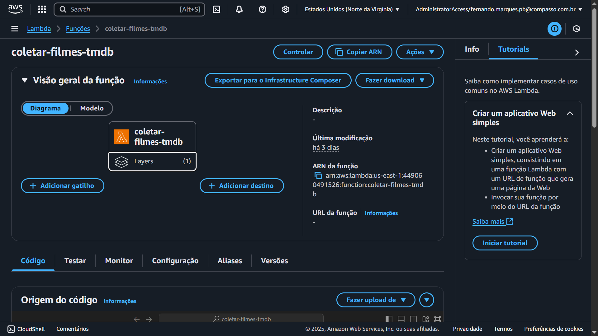

    Inserção da camada "requests-layer" na função
    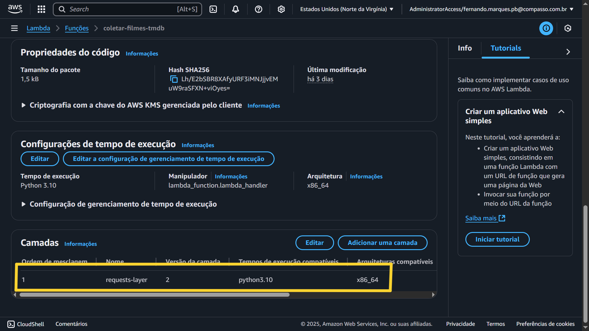

    Inserção da chave da API TMDB na função
    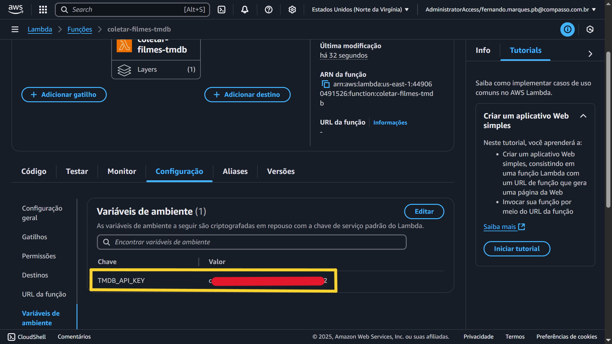

    Execução da função
    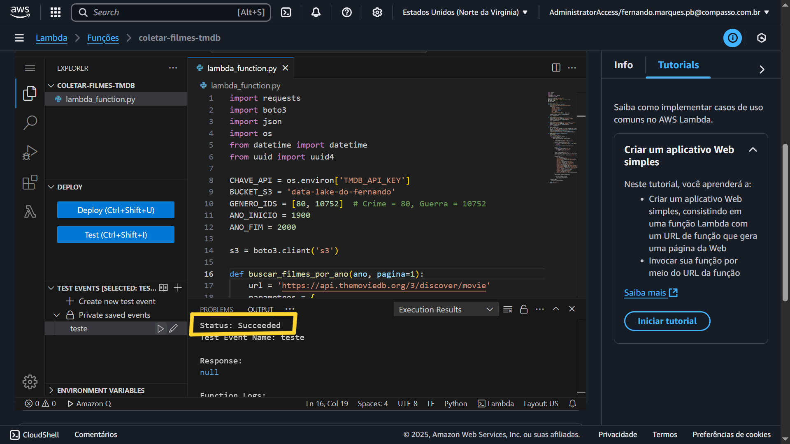

    #### Depois:

    Inserção do arquivo no formato JSON ao bucket seguindo o caminho correto
    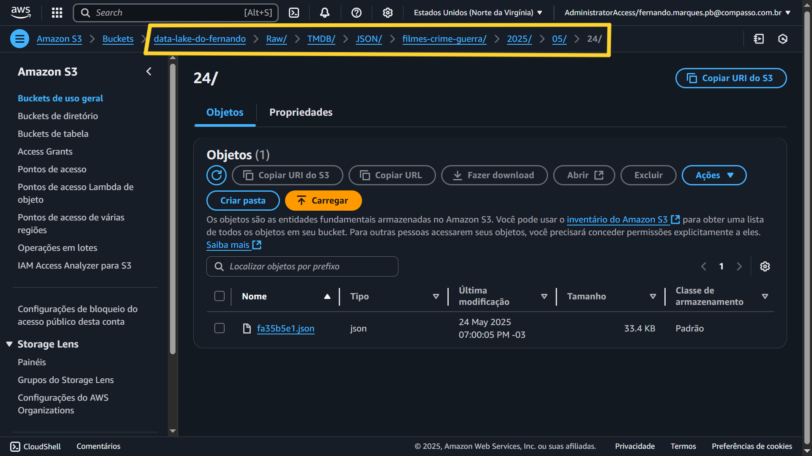
