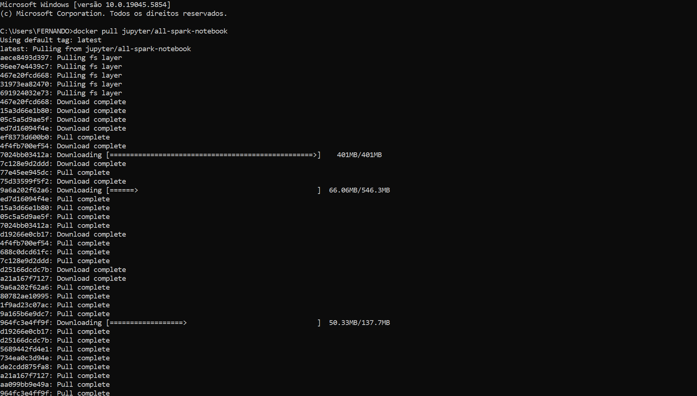

# Resumo

## Apache Spark - Contador de Palavras

### Objetivo:

Configurar e executar um job de processamento de dados utilizando o Apache Spark dentro de um container Docker, com base na imagem `jupyter/all-spark-notebook`. A atividade teve como foco a prática de conceitos fundamentais do Spark e a familiarização com ambientes containerizados para análise de dados.

### O que aprendi:

- Como utilizar o Docker para baixar e executar uma imagem com Spark e Jupyter Lab.
- Como iniciar e interagir com um container no modo interativo.
- Como acessar o Jupyter Lab por meio do navegador utilizando a URL gerada pelo container.
- Como utilizar o `docker exec` para rodar comandos adicionais no container em execução.
- Como iniciar o **PySpark** shell e executar comandos de transformação e análise de dados com RDDs.
- Como fazer download de arquivos externos diretamente no ambiente do container com `wget`.
- Como realizar uma contagem de palavras (WordCount) utilizando comandos Spark:
  - `sc.textFile()`
  - `flatMap()`, `map()`, `reduceByKey()`, `sortBy()`, `collect()`

### Aplicações práticas:

- Processar grandes volumes de texto distribuído (logs, artigos, arquivos JSON/CSV) usando Spark.
- Utilizar containers Docker para garantir que o ambiente de análise seja idêntico em qualquer máquina.
- Criar etapas de transformação em pipelines de dados maiores, integrando fontes como bancos de dados, APIs ou sistemas de arquivos distribuídos (Amazon S3).
- Utilizar notebooks interativos para testes rápidos com Spark antes de migrar para ambientes de produção.
- Base sólida para o uso de Spark em projetos com ferramentas como AWS Glue.

### Evidências

Pull da imagem

Criação do container a partir da imagem

Link de acesso ao Jupyter Lab

Acesso ao Jupyter Lab

Terminal interativo do Spark

Download do README usando wget

Comandos Spark do contador de palavras

## Exercícios TMDB

### Objetivo:

Desenvolver um processo simples de extração de dados da API do TMDB (The Movie Database) utilizando Python. A proposta é adquirir dados de filmes — como título, data de lançamento e sinopse — e prepará-los para uso posterior em projetos de análise de dados e visualização com ferramentas como AWS S3, AWS Glue e Amazon QuickSight.

### O que aprendi:

- Utilizar uma chave de API para autenticar requisições HTTP.

- Estruturar chamadas à API REST do TMDB com parâmetros personalizados (ex: idioma).

- Interpretar e manipular dados em formato JSON retornado pela API.

- Utilizar Python e a biblioteca requests para consumir dados externos.

- Transformar os dados recebidos em um DataFrame com pandas para futura análise.

- Checar o status da requisição para garantir a integridade da resposta.

### Aplicações práticas:

- Construção de pipelines de dados para alimentar um data lake na AWS.

- Criação de dashboards analíticos com Amazon QuickSight, utilizando dados enriquecidos sobre filmes.

- Apoio em projetos de machine learning com informações categóricas e numéricas sobre filmes.

- Desenvolvimento de análises exploratórias sobre tendências de gênero, popularidade ou avaliações de filmes.

- Integração com serviços como AWS Lambda e Amazon S3, permitindo automatizar a ingestão e persistência dos dados extraídos.

### Evidências

Criação da conta no TMDB

Resultado do teste do código python usando as credenciais e biblioteca da API

# Certificados

### Fundamentals of Analytics on AWS – Part 1 (Português)

### Introduction to Amazon Athena (Português)

### Serverless Analytics (Português)

