# Processamento Camada Trusted (Data Lake)

Este documento descreve a lógica e implementação dos dois jobs de processamento de dados com AWS Glue, que transformam dados brutos da camada Raw para dados limpos e padronizados na camada Trusted, usando Apache Spark.

## Objetivo Geral

### Criar pipelines de processamento de dados que:

- Leem arquivos da camada Raw (no Amazon S3).

- Fazem limpeza leve e padronização.

- Gravem os dados em formato Parquet, particionados por data de ingestão (ano/mes/dia), na camada Trusted.

- Sejam compatíveis com consultas no AWS Athena.

## Estrutura das Zonas do Data Lake

### Raw Zone:

- `s3://data-lake-do-fernando/Raw/Local/CSV/Movies/2025/05/24/movies.csv`

- `s3://data-lake-do-fernando/Raw/Local/CSV/Series/2025/05/24/series.csv`

- `s3://data-lake-do-fernando/Raw/TMDB/JSON/filmes-crime-guerra/2025/05/24/fa35b5e1.json`

### Trusted Zone (Parquet particionado):

- `s3://data-lake-do-fernando/Trusted/Local/PARQUET/Movies/ano=AAAA/mes=MM/dia=DD/`

- `s3://data-lake-do-fernando/Trusted/Local/PARQUET/Series/ano=AAAA/mes=MM/dia=DD/`

- `s3://data-lake-do-fernando/Trusted/TMDB/PARQUET/ano=AAAA/mes=MM/dia=DD/`

## Jobs

1. ... [Job I](job-1)

    ### Processamento de Arquivos CSV

    #### Objetivo:

    Transformar arquivos CSV brutos em formato Parquet padronizado e particionado.

    #### Origens:

    - filmes.csv – localizado em `s3://data-lake-do-fernando/Raw/Local/CSV/Movies/2025/05/24/movies.csv`

    - series.csv – localizado em `s3://data-lake-do-fernando/Raw/Local/CSV/Series/2025/05/24/series.csv`

    #### Ações realizadas:

    - Leitura dos arquivos CSV com cabeçalho.

    - Adição das colunas ano, mes, dia com base na data de execução.

    - Escrita em Parquet particionado, em caminhos separados.

    - Formato de destino compatível com Glue Crawler + Athena.
    
    #### Tecnologias usadas:

    - AWS Glue (Spark Script)

    - GlueContext (write_dynamic_frame.from_options)

    - PySpark
   
    #### Evidências:

    Os prints serão separados em antes e depois da execução do script.

    Antes:

    Sem a camada Trusted no bucket
    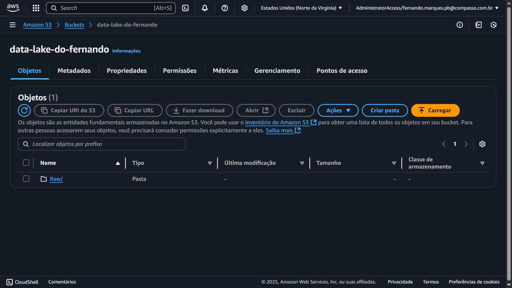

    Sem o primeiro job do desafio
    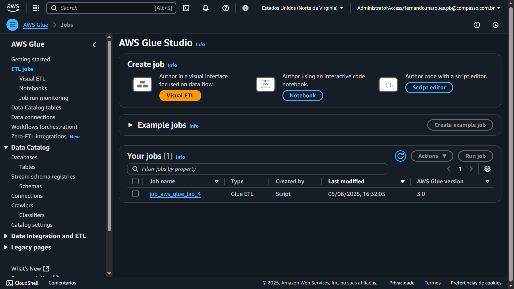

    Criação do primeiro job do desafio
    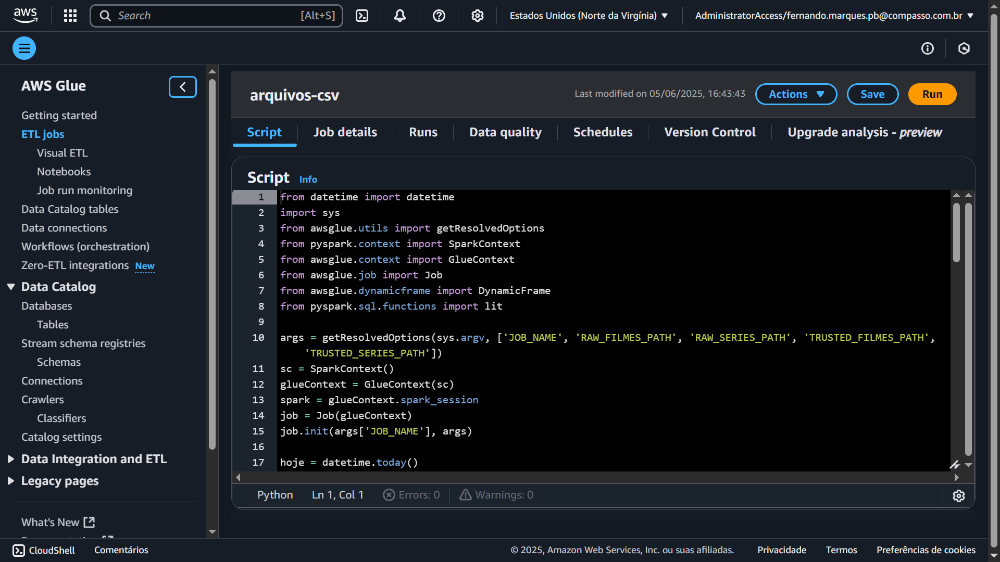

    Execução do primeiro job do desafio
    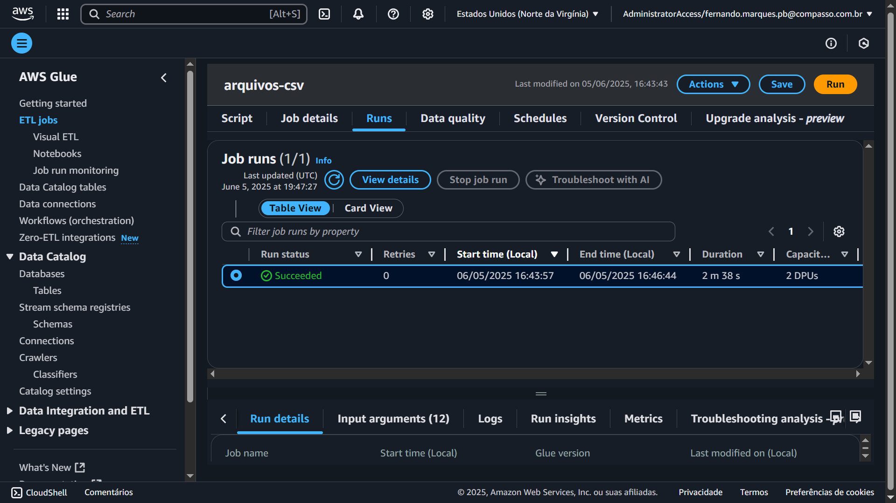

    Depois:

    Criação da camada Trusted no bucket
    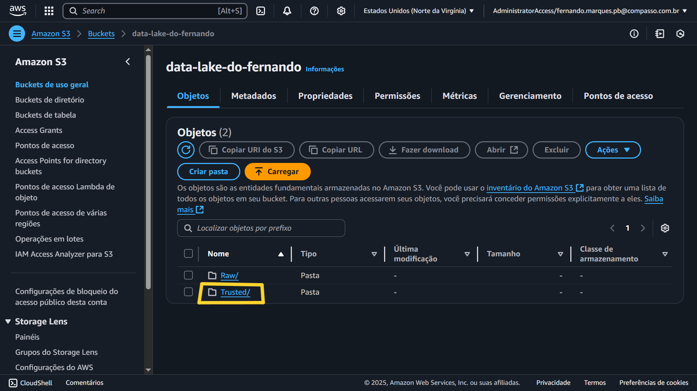

    Inserção dos arquivos PARQUET de movies ao bucket seguindo o caminho correto
    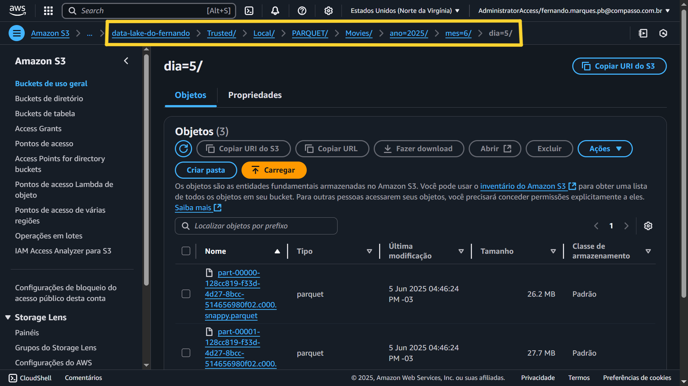

    Inserção dos arquivos PARQUET de series ao bucket seguindo o caminho correto
    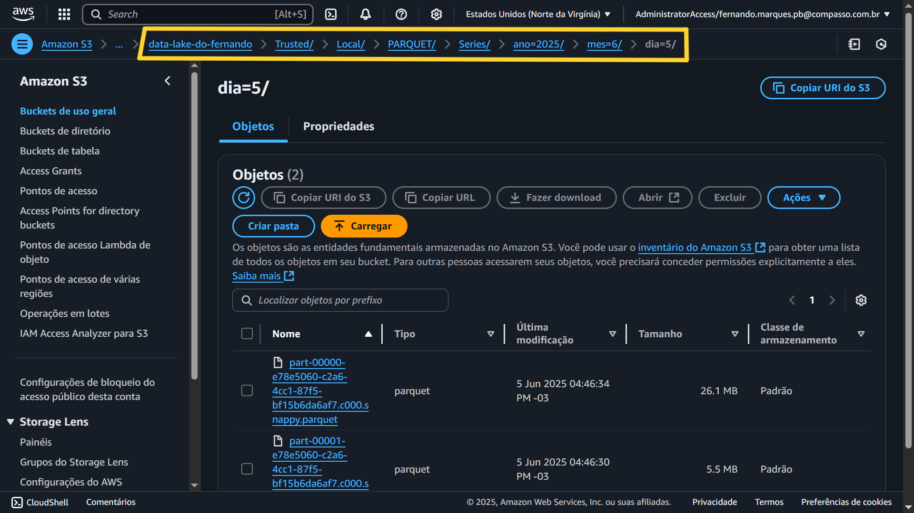

---

2. ... [Job II](job-2)

    ### Processamento de Arquivo JSON (API TMDB)

    #### Objetivo:

    Transformar dados oriundos da API TMDB (salvos em JSON como lista) em formato Parquet padronizado e particionado.

    #### Origem:

    - localizado em `s3://data-lake-do-fernando/Raw/TMDB/JSON/filmes-crime-guerra/2025/05/24/fa35b5e1.json`

    #### Ações realizadas:

    - Leitura usando spark.read.option("multiline", "true").json(...) para aceitar JSON em formato de lista.

    - Conversão para Glue DynamicFrame.

    - Adição das colunas ano, mes, dia.

    - Escrita em Parquet particionado na Trusted Zone.

    - Formato compatível com Glue Crawler + Athena.
    
    #### Tecnologias usadas:

    - AWS Glue (Spark Script)

    - GlueContext + SparkSession

    - DynamicFrame
   
    #### Evidências:

    Os prints serão separados em antes e depois da execução do script.

    Antes:

    Sem o segundo job do desafio
    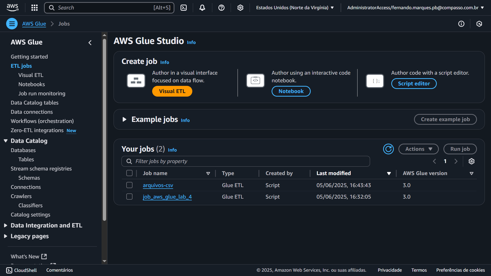

    Criação do segundo job do desafio
    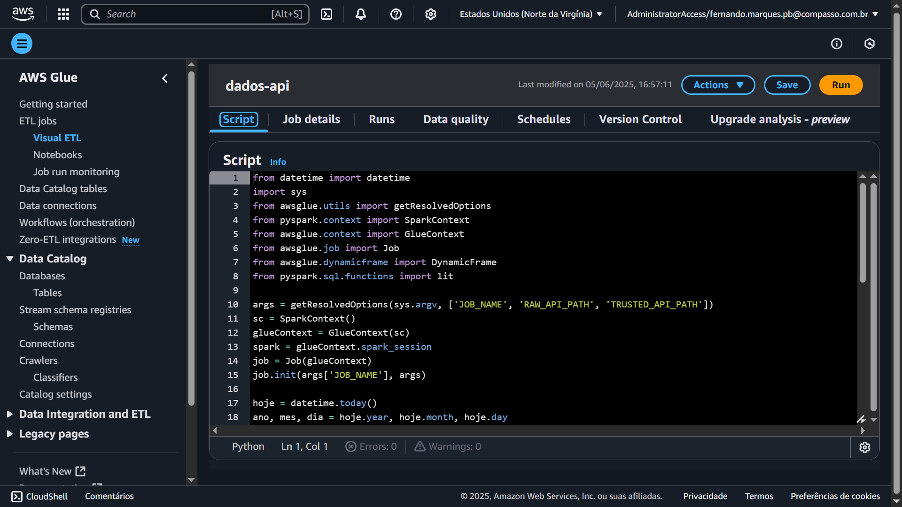

    Execução do segundo job do desafio
    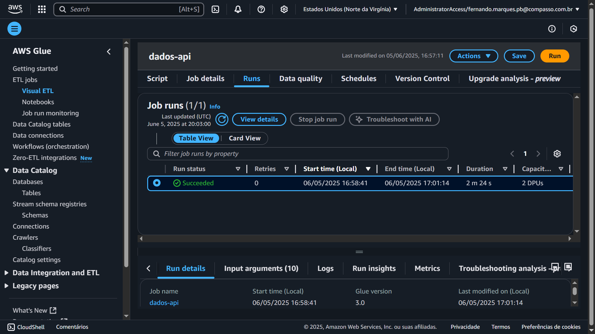

    Depois:

    Inserção do arquivo PARQUET dos dados da API TMDB ao bucket seguindo o caminho correto
    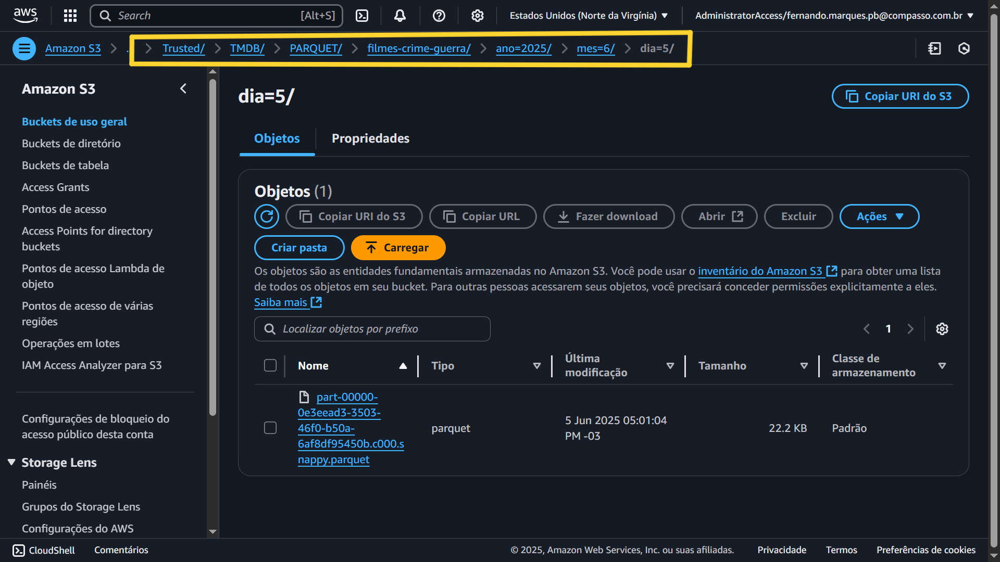
