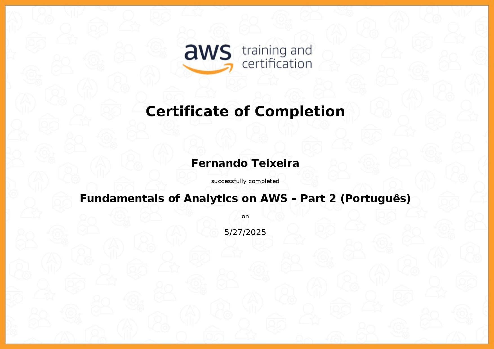

# Resumo

## Geração/massa de dados e Apache Spark

### Objetivo:

Aplicar técnicas de geração e manipulação de dados utilizando Python e Apache Spark. O foco foi desenvolver um pipeline simples para criação de datasets, aplicação de transformações e uso de Spark SQL para análises básicas.

### Tecnologias Utilizadas:

- Python 3.x

- Biblioteca names para geração de nomes aleatórios

- Apache Spark (PySpark)

- Spark SQL

- Operações com DataFrames

- Comandos SQL sobre tabelas temporárias

### O que aprendi de acordo com as etapas dos exercícios:

#### Etapa 1:

- Geração de uma lista com 250 números inteiros aleatórios.

- Aplicação do método .reverse() e exibição dos resultados.

#### Etapa 2:

- Criação de uma lista com 20 nomes de animais.

- Ordenação crescente.

- Iteração e impressão usando list comprehension.

- Escrita dos nomes em um arquivo .txt, um por linha.

#### Etapa 3 a 7:

- Instalação e uso da biblioteca names para gerar 10 milhões de nomes aleatórios com ~39 mil únicos.

- Escrita dos nomes em um arquivo nomes_dataset.txt.

- Leitura do arquivo com spark.read.csv.

- Renomeação de coluna para Nomes.

- Adição da coluna Escolaridade com valores aleatórios entre:

  - Fundamental

  - Médio

  - Superior

- Adição da coluna AnoNascimento com valores aleatórios entre 1945 e 2010.

- Criação de temp view e uso de Spark SQL para consultas.

#### Etapa 8:

- Uso do método .filter() para contar pessoas da geração Millennials (nascidos entre 1980 e 1994).

#### Etapa 9:

- Repetição da análise da Etapa 7 usando Spark SQL com COUNT(*).

#### Etapa 10:

- Criação de uma coluna Pais com valores aleatórios (Brasil, Estados Unidos, Canadá).

- Criação da coluna Geracao com base no ano de nascimento:

  - Baby Boomers: 1944–1964

  - Geração X: 1965–1979

  - Millennials: 1980–1994

  - Geração Z: 1995–2015

- Consulta via Spark SQL para agrupar e contar pessoas por País e Geração, com ordenação crescente.

### Aplicações práticas:

- Ideal para simular dados de usuários, clientes ou cadastros em ambientes de teste ou desenvolvimento, evitando o uso de dados reais e sensíveis.
- Útil para construir dashboards, relatórios e KPIs em ferramentas como Amazon QuickSight, Power BI, etc.
- O conhecimento adquirido é aplicável na construção de pipelines para soluções baseadas em cloud (ex: AWS Glue, S3, Athena).

### Evidências

Geração e massa de dados:

- Etapa 1:

  - [Código python](./Exercicios/parte1-geração-e-massa-de-dados/etapa1/ex.py)
  - [Resultado](./Evidencias/exercicio/parte1-geracao-e-massa-de-dados/1.png)

- Etapa 2:

  - [Código python](./Exercicios/parte1-geração-e-massa-de-dados/etapa2/ex.py)
  - [Resultado](./Exercicios/parte1-geração-e-massa-de-dados/etapa2/animais.txt)

- Etapa 3:

  - [Código python](./Exercicios/parte1-geração-e-massa-de-dados/etapa2/ex.py)
  - [Resultado](./Exercicios/parte1-geração-e-massa-de-dados/etapa3/nomes_aleatorios.txt)

Apache Spark:

- Etapa 1:

  - [Código python](./Exercicios/parte2-apache-spark/etapa1/ex.py)
  - [Resultado](./Evidencias/exercicio/parte2-apache-spark/2.png)

- Etapa 2:

  - [Código python](./Exercicios/parte2-apache-spark/etapa2/ex.py)
  - [Resultado](./Evidencias/exercicio/parte2-apache-spark/3.png)

- Etapa 3:

  - [Código python](./Exercicios/parte2-apache-spark/etapa3/ex.py)
  - [Resultado](./Evidencias/exercicio/parte2-apache-spark/4.png)

- Etapa 4:

  - [Código python](./Exercicios/parte2-apache-spark/etapa4/ex.py)
  - [Resultado](./Evidencias/exercicio/parte2-apache-spark/5.png)

- Etapa 5:

  - [Código python](./Exercicios/parte2-apache-spark/etapa5/ex.py)
  - [Resultado](./Evidencias/exercicio/parte2-apache-spark/6.png)

- Etapa 6:

  - [Código python](./Exercicios/parte2-apache-spark/etapa6/ex.py)
  - [Resultado](./Evidencias/exercicio/parte2-apache-spark/7.png)

- Etapa 7:

  - [Código python](./Exercicios/parte2-apache-spark/etapa7/ex.py)
  - [Resultado](./Evidencias/exercicio/parte2-apache-spark/8.png)

- Etapa 8:

  - [Código python](./Exercicios/parte2-apache-spark/etapa8/ex.py)
  - [Resultado](./Evidencias/exercicio/parte2-apache-spark/9.png)

- Etapa 9:

  - [Código python](./Exercicios/parte2-apache-spark/etapa9/ex.py)
  - [Resultado](./Evidencias/exercicio/parte2-apache-spark/10.png)

- Etapa 10:

  - [Código python](./Exercicios/parte2-apache-spark/etapa10/ex.py)
  - [Resultado](./Evidencias/exercicio/parte2-apache-spark/11.png)

## Lab AWS Glue

### Objetivo:

Processar e analisar dados de nomes registrados nos EUA utilizando AWS Glue com scripts em PySpark, salvando os resultados tratados no Amazon S3. Ao longo do projeto, realizamos diversas transformações, filtragens, agrupamentos e gravações, praticando habilidades de engenharia de dados em nuvem com foco em processamento escalável.

### Tecnologias Utilizadas:

- AWS Glue

- PySpark (via GlueContext)

- Amazon S3

- CloudWatch Logs

- IAM Roles para Glue com acesso ao S3

### O que aprendi de acordo com os assuntos do laborátorio:

#### AWS Glue:

- Utilização do AWS Glue Job (script em PySpark).

- Manipulação de parâmetros de entrada (getResolvedOptions) para tornar o job reutilizável.

- Leitura e gravação de dados no S3 usando create_dynamic_frame.from_options e write_dynamic_frame.from_options.

- Uso de particionamento ao salvar arquivos no S3 (por sexo e ano).

- Compreensão sobre onde visualizar logs e prints: Amazon CloudWatch.

#### PySpark e GlueContext:

- Conversão entre DynamicFrame ↔ DataFrame para permitir uso de APIs Spark SQL.

- Impressão de schema, contagem de registros e aplicação de filtros com expressões condicionais.

- Uso de funções como upper, count, sum, groupBy, orderBy, desc, etc.

#### Manipulação e transformação de dados:

- Leitura de arquivo nomes.csv com delimitador personalizado (|).

- Conversão de valores da coluna nome para caixa alta (maiúsculo).

- Agrupamento de dados por ano e sexo.

- Cálculo dos nomes com maior frequência por sexo.

- Cálculo de totais por ano com ordenação.

- Escrita final em JSON no S3, com particionamento e overwrite mode.

### Aplicações Práticas:

- Estudo da popularidade de nomes por período histórico, gênero ou região.

- Empresas podem entender tendências de nomes e faixas etárias para marketing direcionado.

- O projeto serve como base prática para cursos de Big Data, Data Lake e AWS.

- O código pode ser adaptado para processar outros CSVs com schemas semelhantes, integrando facilmente com pipelines de ETL.

### Evidências

As evidências serão separadas em antes e depois da execução do job.

#### Antes:

[Código python da criação do bucket](./Exercicios/parte3-lab-aws-glue/upload_s3.py)

Criação do bucket

[Código AWS Glue da criação do job](./Exercicios/parte3-lab-aws-glue/job_aws_glue_lab_4.py)

Criação do job

Visualização do job

Execução do job

#### Depois:

Criação e execução do Crawler

Tabela após execução do Crawler

Consulta da tabela

Resultado da consulta

Particionamento do sexo no bucket

Particionamento do ano no bucket

Arquivo JSON do particionamento no bucket

# Certificados

### Fundamentals of Analytics on AWS – Part 2 (Português)

### AWS Glue Getting Started

