# Camada Refined do Data Lake (TMDB + Local)

## Objetivo

A camada Refined representa o estágio mais estruturado e analítico do nosso Data Lake, na qual os dados foram modelados segundo os princípios de modelagem dimensional, tornando-os prontos para análise no Amazon Athena e no Amazon QuickSight.

Os dados tratados vêm de duas fontes:

- Trusted/Local: CSVs originais de filmes e séries

- Trusted/TMDB: Dados coletados via API do The Movie Database

### Jobs criados:

| Job                    | Fonte (Trusted)                 | Objetivo                                  |
| ---------------------- | ------------------------------- | ----------------------------------------- |
| `refined_tmdb_job.py`  | TMDB (obra, cast, crew)         | Modelar fatos e dimensões do TMDB         |
| `refined_local_job.py` | Local (filmes.csv e series.csv) | Modelar fatos e dimensões da origem local |

### Tabelas criadas:

#### TMDB:

| Tabela              | Tipo     | Descrição                                        |
| ------------------- | -------- | ------------------------------------------------ |
| `fatoobra_...`         | Fato     | Dados das obras (filmes/séries) coletadas da API |
| `fatoparticipacao` | Fato     | Relação entre artistas (cast/crew) e obras       |
| `dimartista_...`       | Dimensão | Informações dos artistas                         |
| `dimtempo_...`         | Dimensão | Calendário baseado em `data_lancamento`          |

#### Local:

| Tabela              | Tipo     | Descrição                                       |
| ------------------- | -------- | ----------------------------------------------- |
| `fatoobra`   | Fato     | Informações principais dos filmes/séries locais |
| `dimartista` | Dimensão | Artistas vinculados às obras                    |
| `dimtempo`   | Dimensão | Derivada de `anoLancamento`                     |

Todas essas tabelas foram geradas em formato Parquet, na Refined Zone do bucket S3.

### Filtro aplicado
Em ambos os jobs, foi aplicado filtro para considerar somente filmes e séries do gênero primário "crime" ou "war (guerra)".

### Explicação do código no job

`dados-refined-api` (resumo por blocos)

Lê as obras da camada Trusted:

    df_obra = spark.read.parquet(...)

Aplica o filtro para gênero principal de 'crime' ou 'guerra'

    df_obra_filtrada = df_obra.filter(...)

Lê o elenco:

    df_cast = spark.read.parquet(...)

Lê equipe técnica:

    df_crew = spark.read.parquet(...)

Converte data_lancamento para tipo date:

    df_fato_obra = df_obra.withColumn(...)

Cria a dimensão artista:

    df_artistas_cast = df_cast.select(...)
    df_artistas_crew = df_crew.select(...)

Une artistas de cast e crew:

    df_dim_artista = cast.unionByName(crew)

Extrai os IDs das obras após o filtro de gênero e evita duplicatas:

    obra_ids_filtradas = df_fato_obra.select(...)

Seleciona as colunas relevantes da tabela de elenco e faz join com 'obra_id':

    df_part_cast = df_cast.select(...)

Seleciona as colunas relevantes da tabela de equipe técnica e faz join com 'obra_ids_filtradas':

    df_part_crew = df_crew.select(...)

`dados-refined-local.py` (resumo por blocos)

Lê filmes e marca tipo = 'movie':

    df_movies = spark.read.parquet(...)

Lê séries e marca tipo = 'series'

    df_series = spark.read.parquet(...)

Une e filtra por genero principal de 'crime' ou 'war':

    df_completo = union().filter(...)

Seleciona atributos principais da obra:

    df_fato_obra_local = df_completo.select(...)

Seleciona artistas, mantendo o id_obra como FK:

    df_dim_artista_local = (...)

Gera data fictícia (ano-01-01) para dimensão tempo:

    df_tempo = (...)

### Como usar no Athena

Após executar os crawlers, você pode consultar as tabelas assim:

    SELECT * FROM refined_datalake.fato_obra WHERE vote_average > 8;

### Requisitos atendidos

- Dados integrados e limpos nas Refined Zones

- Modelagem dimensional aplicada (fato + dimensões)

- Filtro de gênero (crime ou guerra)

- Disponibilizado no Glue + Athena

- Formato otimizado (Parquet)

### Evidências:

Jobs dos dados de Local e TMDB
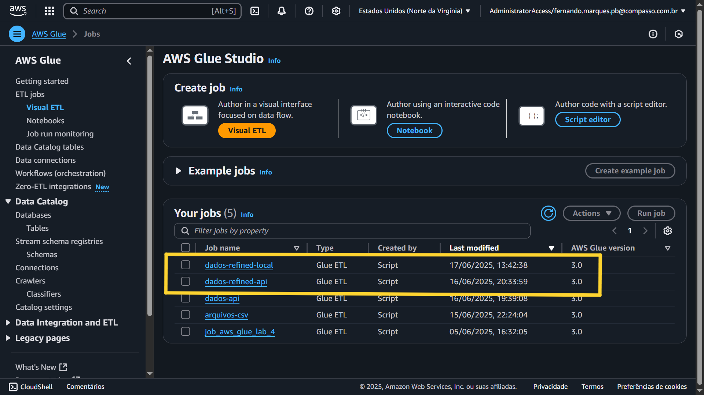

Código do job Local
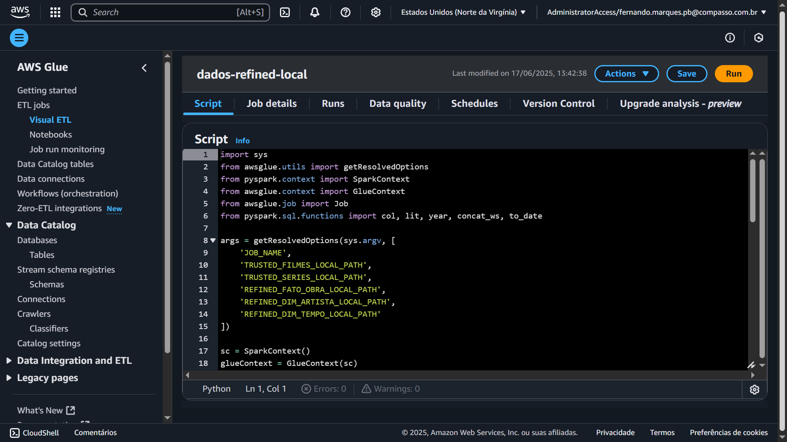

Execução do job Local
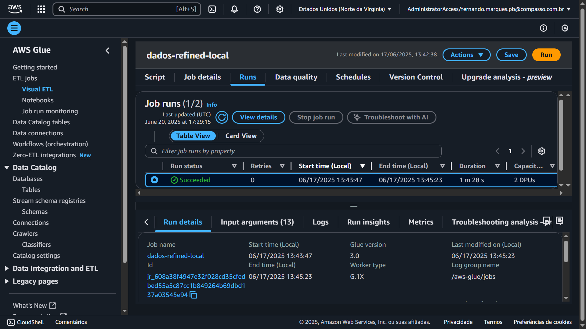

Código do job TMDB
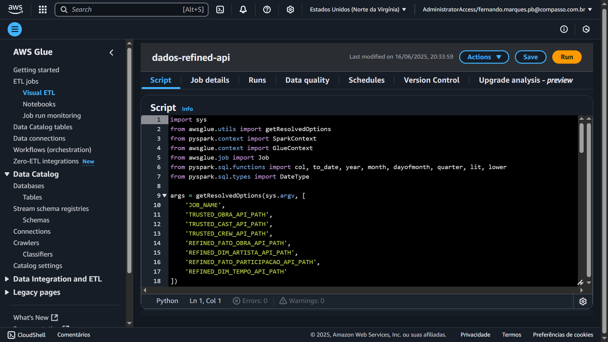

Execução do job TMDB
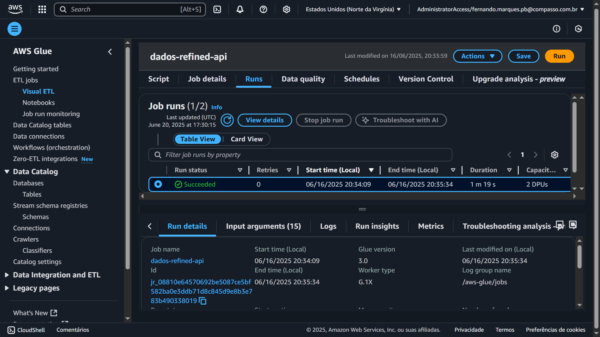

Criação da camada Refined
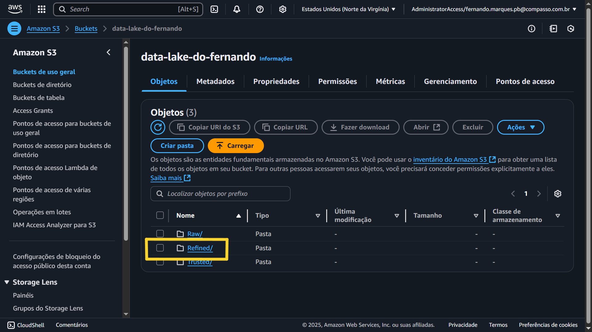

Tabelas dimensão e tabela fato de Local
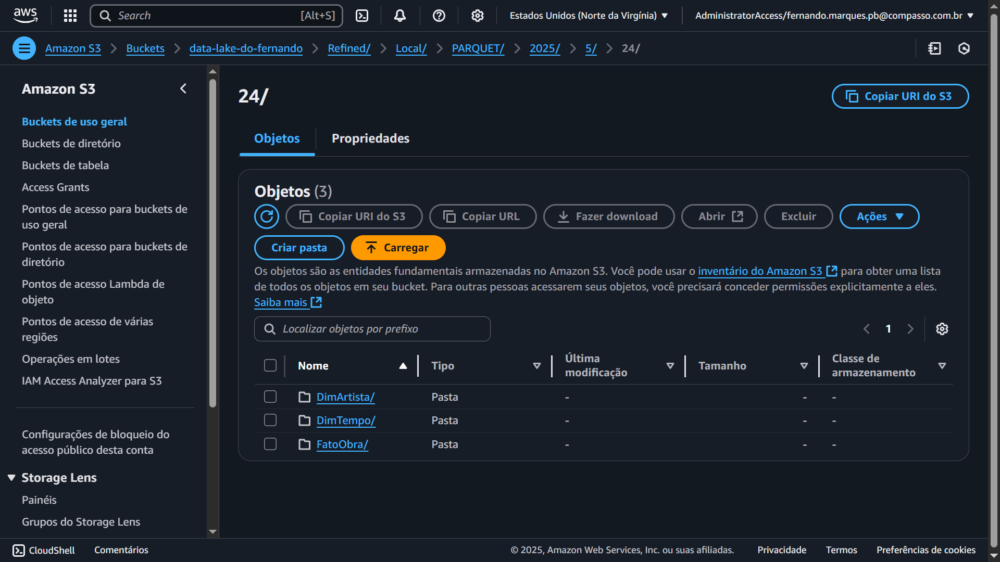

Caminho dos dados de Local
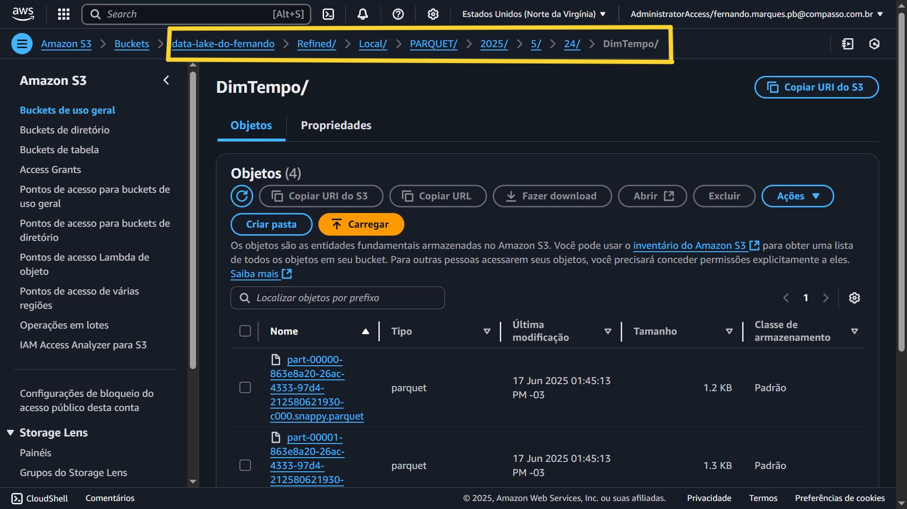

Tabelas dimensão e tabelas fato de TMDB
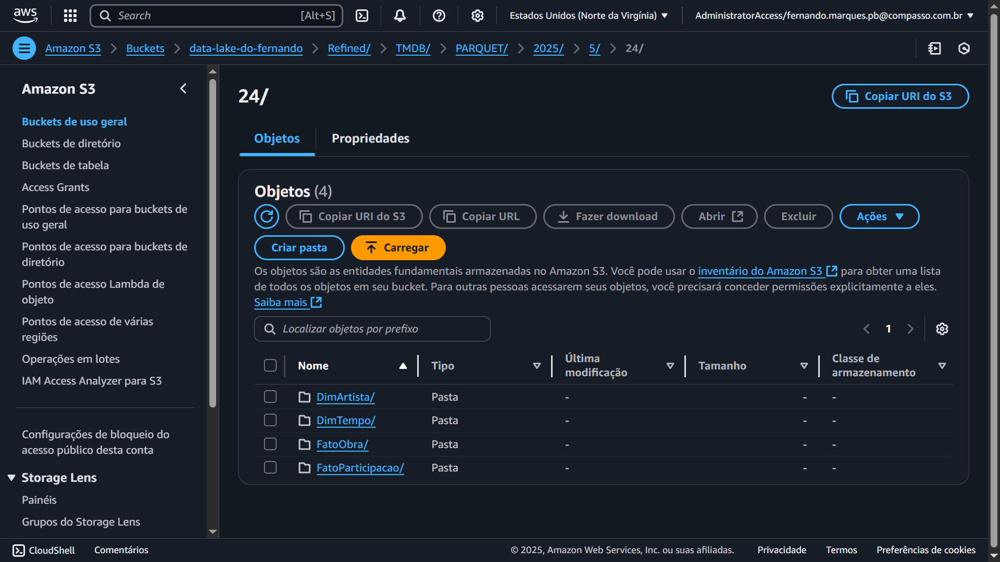

Caminho dos dados de TMDB
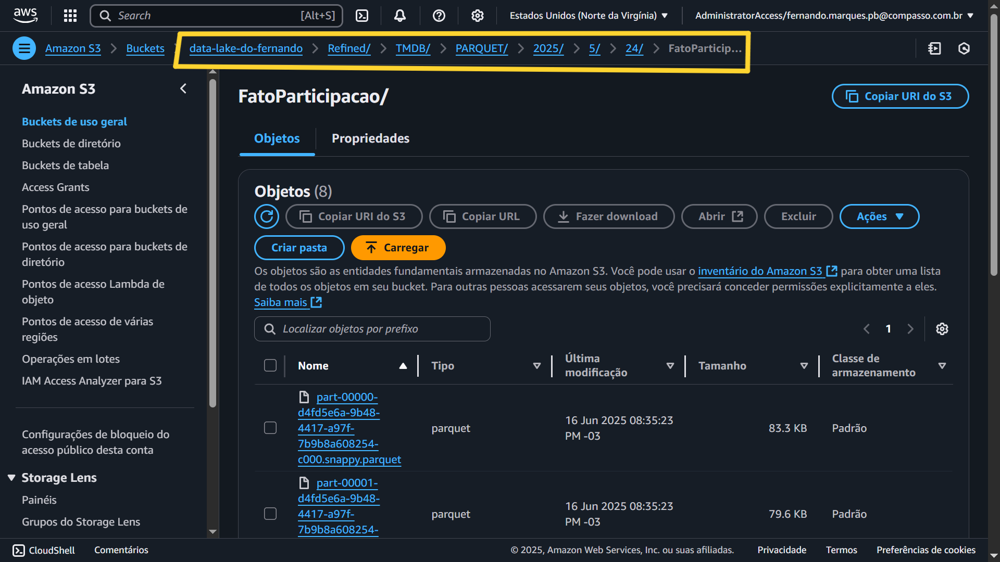

Criação de execução dos Crawlers
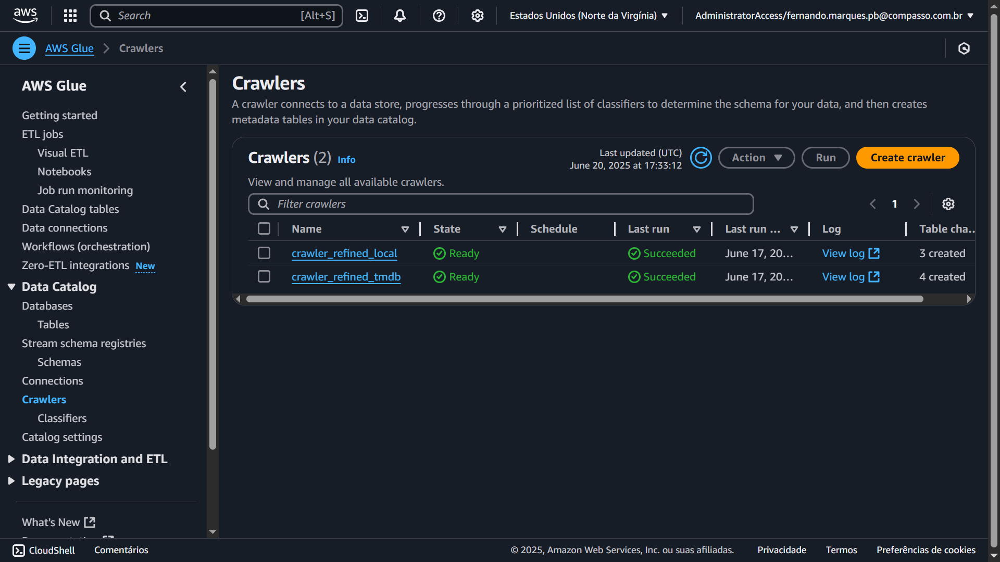

Tabelas no Data Catalog
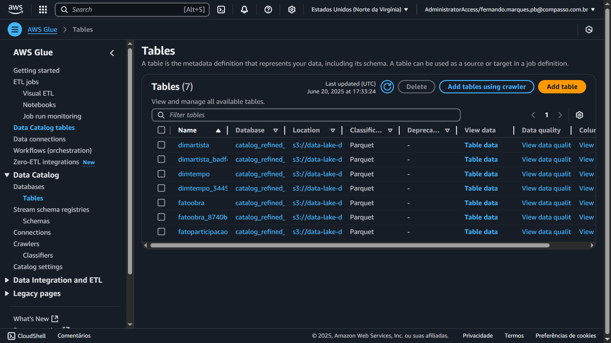

Execução de uma query no Athena
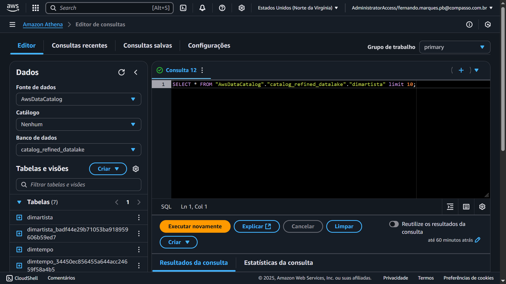

Resultado de uma query no Athena
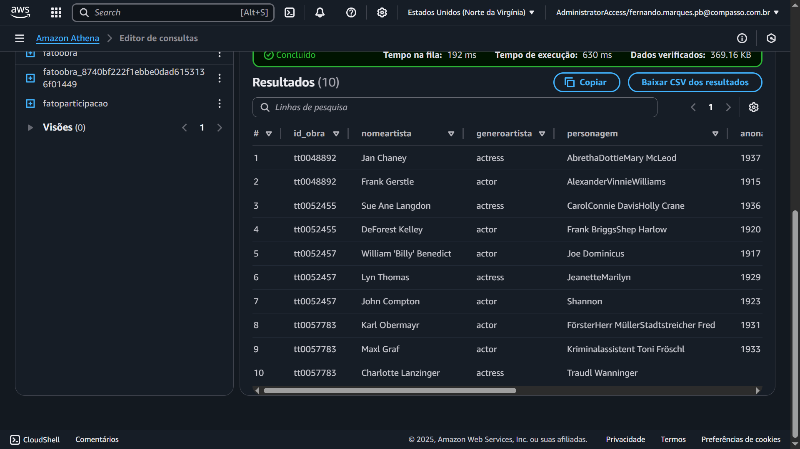