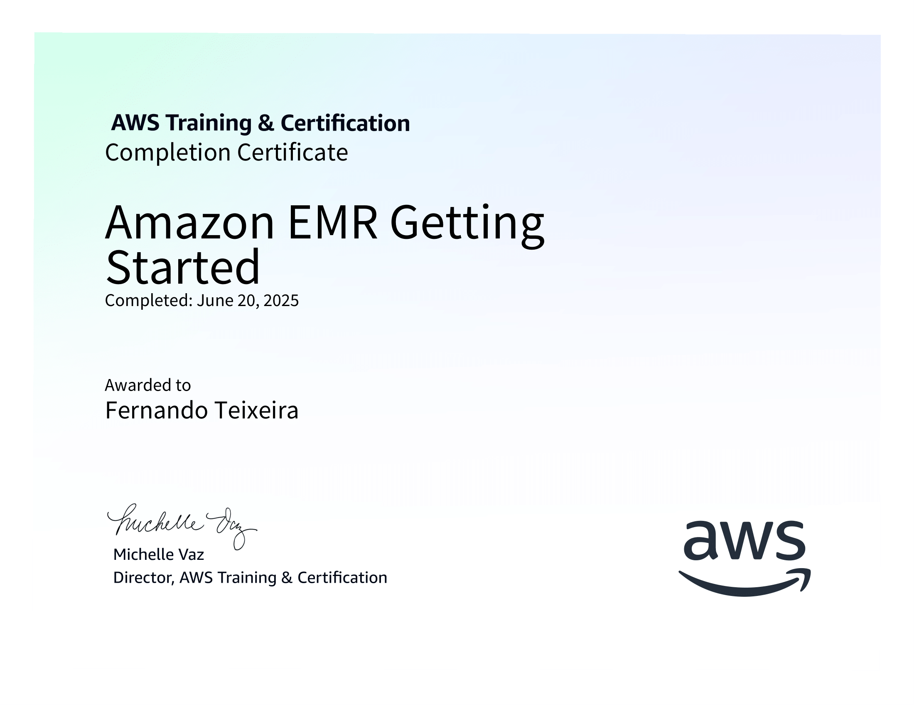
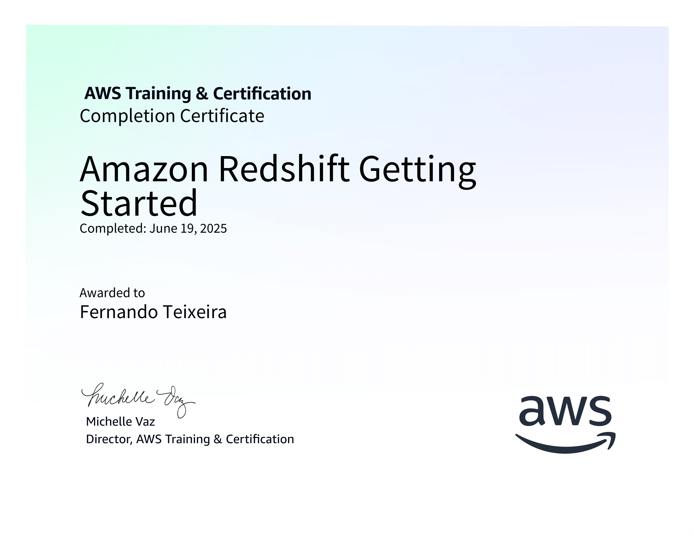
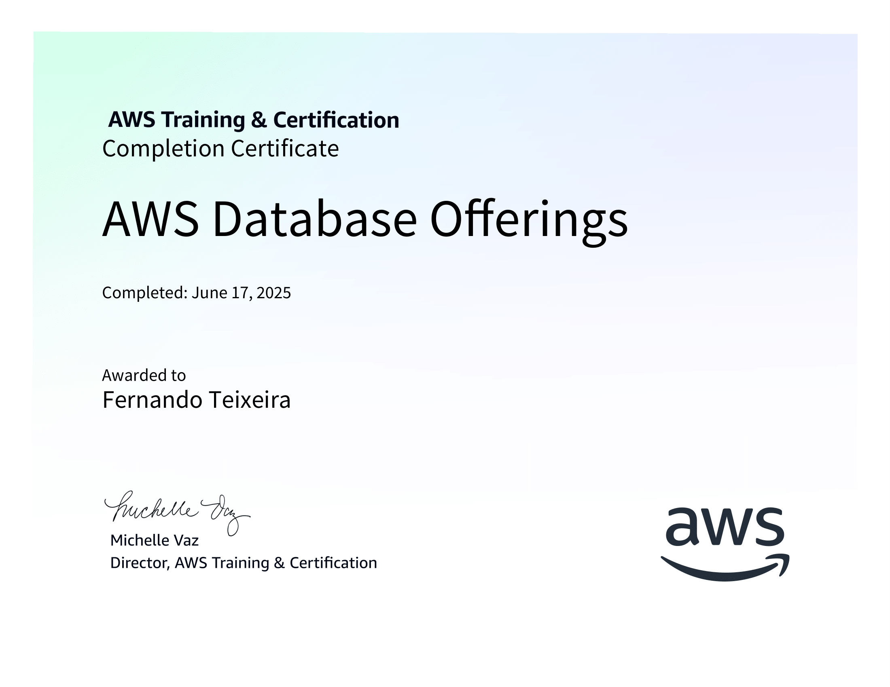
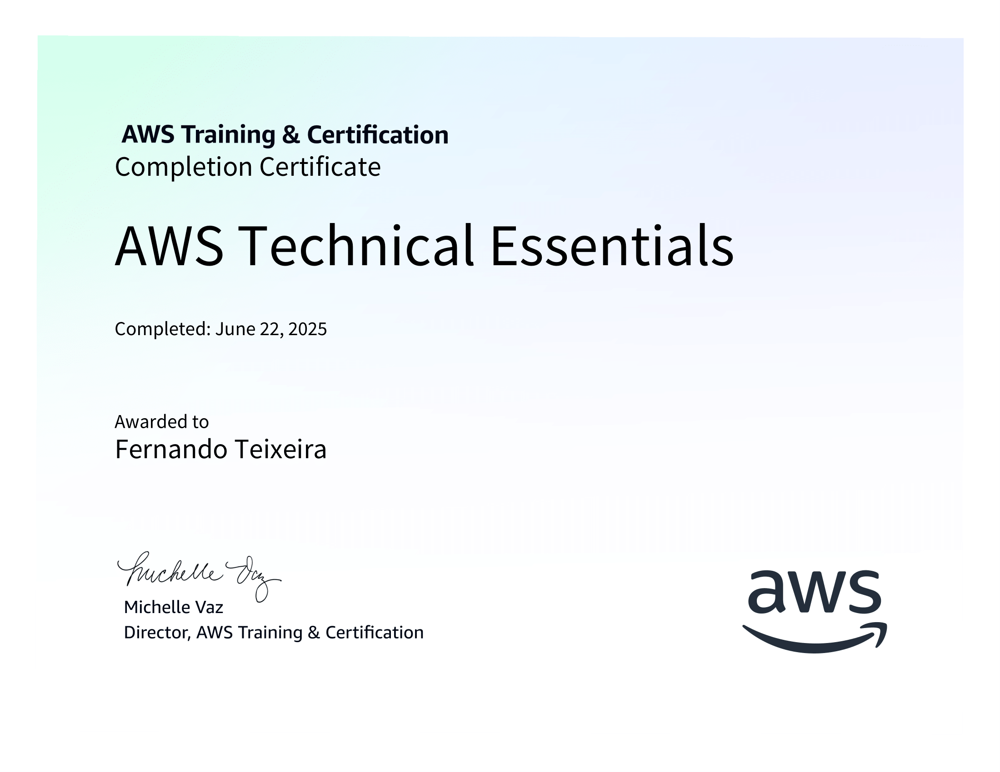

# Resumo

## Processamento de Dados Refined com AWS Glue, TMDB e Athena

### Visão Geral:

Esta sprint representa a etapa de modelagem e disponibilização de dados na camada Refined de um Data Lake na AWS. Os dados vêm de duas fontes:

- Arquivos locais CSV com dados de filmes e séries;

- Dados enriquecidos da API do TMDB (The Movie Database).

Nosso objetivo foi transformar, padronizar e disponibilizar essas informações em formato analítico e otimizado, seguindo os princípios da modelagem dimensional, prontos para exploração no Athena e no QuickSight.

### Tecnologias Utilizadas:

| Tecnologia            | Finalidade                                                 |
| --------------------- | ---------------------------------------------------------- |
| **AWS Glue**          | Transformação dos dados com Spark (ETL)                    |
| **Amazon S3**         | Armazenamento dos dados em camadas (Raw, Trusted, Refined) |
| **AWS Glue Catalog**  | Catálogo de tabelas para o Athena/QuickSight               |
| **AWS Glue Crawlers** | Indexação automática dos arquivos Parquet                  |
| **Amazon Athena**     | Consultas SQL sobre os dados Refined                       |

### Estrutura da Refined Zone:

| Camada    | Origem       | Tabelas geradas                                              |
| --------- | ------------ | ------------------------------------------------------------ |
| **TMDB**  | API JSON     | `fato_obra`, `fato_participacao`, `dim_artista`, `dim_tempo` |
| **Local** | Arquivos CSV | `fato_obra_local`, `dim_artista_local`, `dim_tempo_local`    |

Todos os dados foram salvos em Parquet no S3, otimizados para análise.

### O que aprendi:

#### Job Refined - TMDB

- Manipular arrays e structs do JSON, uso de explode, joins e casts no PySpark.

- Leitura dos arquivos JSON tratados com detalhes de filmes/séries, cast e crew.

- Modelagem da Tabela Fato com dados de obra (ex: título, idioma, orçamento, nota).

- Modelagem das Dimensões de artista e tempo.

- Modelagem da Tabela de participação de artistas na obra (elenco ou equipe).

- Aplicação do filtro por gênero: apenas "crime" e "guerra".

#### Job Refined - Local:

- Uso de schema padronizado, concatenação de fontes, otimização com Parquet.

- União dos dados CSV tratados de filmes e séries, adicionando uma coluna tipo.

- Geração da Tabela Fato com metadados da obra.

- Geração da Dimensão artista com dados como profissão e personagem.

- Geração da Dimensão tempo com base no ano de lançamento.

- Aplicação do mesmo filtro por gênero.

#### Crawlers e Glue Catalog:

- Uso eficiente de crawlers para criar tabelas Athena-ready, sem necessidade de definição manual de schema.

- Criação do Glue Crawler para dados Refined/TMDB.

- Criação do Glue Crawler para dados Refined/Local.

- Automação da criação das tabelas no Glue Data Catalog.

#### Queries no Athena:

- Após os crawlers, realização de consultas SQL no Amazon Athena para validar e explorar os dados:

- Integração fluida entre Glue Catalog e Athena, leitura otimizada de Parquet via SQL.

#### Aplicações Práticas:

- Construção de dashboards sobre filmes/séries no QuickSight (por nota, participação, gênero).

- Criação de análises específicas de elenco técnico por gênero e popularidade.

- Modelo replicável para outros domínios (ex: música, livros, esportes).

## Certificados

### Amazon EMR Getting Started (Português)

### Getting Started with Amazon Redshift (Português)

### AWS Database Offerings (Português)

### AWS Technical Essentials (Português)

