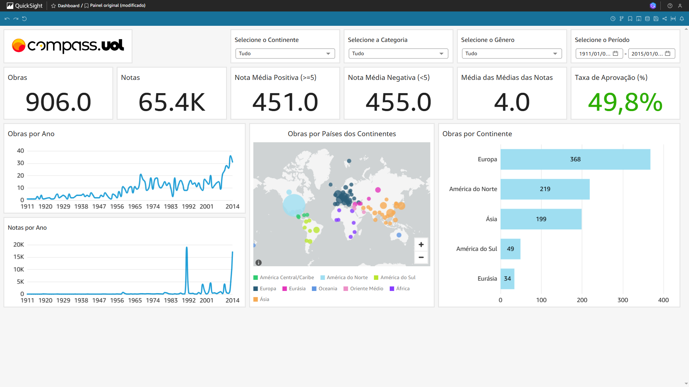
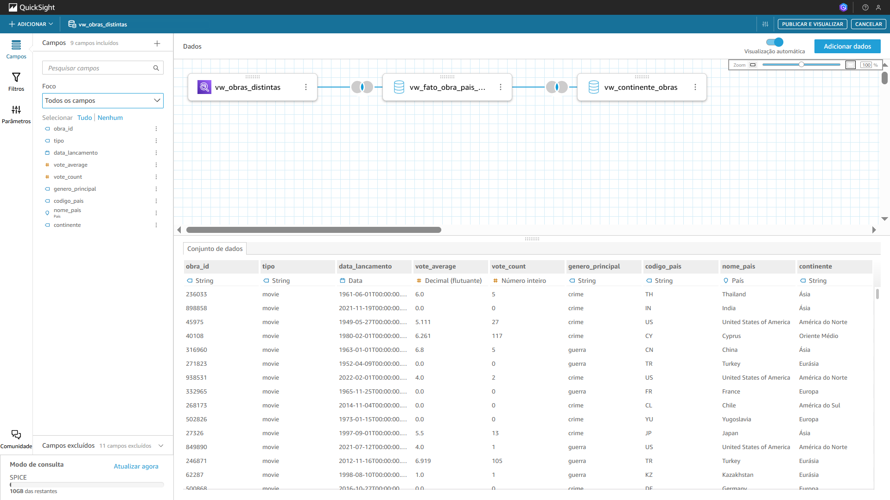

# Análise de Filmes e Séries: Gêneros de Guerra e Crime (1906-2015)

## Objetivo

Este projeto consiste na criação de um dashboard interativo no Amazon Quicksight para analisar um conjunto de dados de mais de um século de produção cinematográfica e televisiva (1906-2015), com foco nos gêneros de Guerra e Crime.

O objetivo principal não é apenas visualizar os dados, mas extrair insights estratégicos sobre tendências históricas, padrões geográficos e a recepção do público, transformando dados brutos em inteligência acionável.

### Fonte de Dados

A análise foi realizada a partir de um dataset contendo informações sobre filmes e séries, abrangendo os seguintes campos principais:

- Quantidade de obras

- Gênero (Guerra, Crime)

- Categoria (Filme, Série)

- Ano de lançamento

- País/Continente de origem

- Total de Avaliações

### Visão Geral do Dashboard no Quicksight

O dashboard foi projetado para ser uma ferramenta de exploração dinâmica. O usuário pode interagir com os seguintes componentes para aprofundar sua própria análise:

#### Filtros Dinâmicos:

- Continente: Permite focar a análise em uma região geográfica específica.

- Gênero: Alterna a visualização entre "Guerra" e "Crime".

- Categoria: Filtra os dados entre "Filmes" e "Séries".

- Período de Data: Um seletor de intervalo de anos (1906 a 2015) para análises temporais.

#### Principais Visualizações e KPIs:

- Cards de KPI: Exibem métricas chave de forma direta (Total de Obras, Média de Aprovação %, Total de Avaliações, etc.).

- Gráfico de Linhas (Evolução Temporal): Mostra o volume de produção de obras e avaliações ao longo do tempo.

- Mapa de Pontos (Distribuição Geográfica): Ilustra a concentração da produção por continente.

- Gráfico de Barras (Ranking por Continente): Detalha o volume de produção por continente em top 5.

### Principais Análises e Insights Extraídos

Através da exploração interativa do dashboard, chegamos a quatro principais conclusões que contam a história por trás dos números:

#### Análise Temporal - O Cinema como Espelho da Sociedade

Ao analisar a linha do tempo, percebemos que a produção cinematográfica não ocorre no vácuo; ela é um reflexo direto do seu contexto histórico.

- A Descoberta: O gráfico de linhas mostra picos claros na produção de filmes de Guerra nos anos seguintes a grandes conflitos, como a Primeira e Segunda Guerra Mundial.

- O Insight: A indústria cinematográfica atua como um catalisador para o debate público, usando o gênero de guerra para processar traumas de conflitos de cada época.

#### Análise Geográfica - Os Polos de Produção e Suas Perspectivas

A análise geográfica revela que a produção não é homogênea, com diferentes regiões dominando e contribuindo com visões distintas.

- A Descoberta: Os países da Europa lideram em volume de produção. No entanto, o continente norte-americano, somado, apresenta uma produção de filmes de guerra quase tão robusta quanto a europeia.

- O Insight: Existem duas narrativas geopolíticas distintas no cinema de guerra: a perspectiva da Europa, frequentemente focada na qualidade e quantidade das obras, e a perspectiva norte-americana, que tende a ser menos abrangente em relação ao conteúdo das obras, criando um certo descontentamento por parte do público.

#### Análise Nicho vs. Mainstream

- A Descoberta: Países de região com volume de produção massivo, como a Europa, dominam as métricas de "total de obras", "total de avaliações" e na popularidade "taxa de aprovação". Contudo, países com produção significativamente parecida (como da região da América do Norte) aparece com uma popularidade inferior.

- O Insight: Isso revela a diferença da narrativa de como as obras estão apresentando com o contexto atual de guerras. Cinematografias semelhantes, porém incapazes de competir em taxa de aprovação, focam na produção de obras de qualidade duvidosa, gerando uma insatisfação da aclamação crítica e se destaca no mercado internacional de forma negativa, provando que relevância tem que ser construída com qualidade, e não apenas com quantidade.

#### Análise das regiões menos predominantes

Tão importante quanto o que os dados mostram é o que a sua ausência revela.

- A Descoberta: O mapa global evidencia uma notável escassez de produção comercial nos gêneros de guerra e crime vinda dos continentes da América do Sul e Eurásia (até 2015).

- O Insight: Esta lacuna não significa falta de histórias, mas aponta para barreiras históricas de financiamento e distribuição que limitaram a visibilidade global dessas narrativas. O dashboard, portanto, também serve como uma ferramenta para identificar mercados e vozes sub-representados na indústria cinematográfica global.

### Views Criadas no Athena

#### 1. `vw_continente_obras`

Cria o relacionamento entre países e seus respectivos continentes. Foi usada no QuickSight para alimentar filtros e visualizações por continente.

    CREATE OR REPLACE VIEW "vw_continente_obras" AS 
    SELECT DISTINCT
    fop.obra_id, 
    fop.nome_pais,
    fop.codigo_pais,
    (CASE WHEN (
        fop.nome_pais IN ('Canada', 'United States of America', 'Mexico', 'Puerto Rico')) 
    THEN 'América do Norte' WHEN ... --demais continentes
    ELSE 'Desconhecido' END) continente
    FROM
    vw_fato_obra_pais_distinto fop

#### 2. `vw_obras_distintas`

Reduz duplicidade de "obra_id" na "fato_obra_unificada" para garantir integridade nas métricas calculadas.

    CREATE OR REPLACE VIEW "vw_fato_obra_pais_distinto" AS 
    WITH
    ranked AS (
    SELECT
        *
    , ROW_NUMBER() OVER (PARTITION BY obra_id ORDER BY nome_pais ASC) rn
    FROM
        fato_obra_unificada
    ) 
    SELECT *
    FROM
    ranked
    WHERE (rn = 1)

#### 3. `vw_fato_obra_distintas`

Mesma função da anterior, mas para "fato_pais_obra". Reduz duplicidade de "obra_id" para garantir integridade nas métricas calculadas.

    CREATE OR REPLACE VIEW "vw_fato_obra_pais_distinto" AS 
    WITH
    ranked AS (
    SELECT
        *
    , ROW_NUMBER() OVER (PARTITION BY obra_id ORDER BY nome_pais ASC) rn
    FROM
        fato_obra_pais
    ) 
    SELECT *
    FROM
    ranked
    WHERE (rn = 1)

### Evidências:

Imagens/gráficos do dashboard

Joins entre as views
