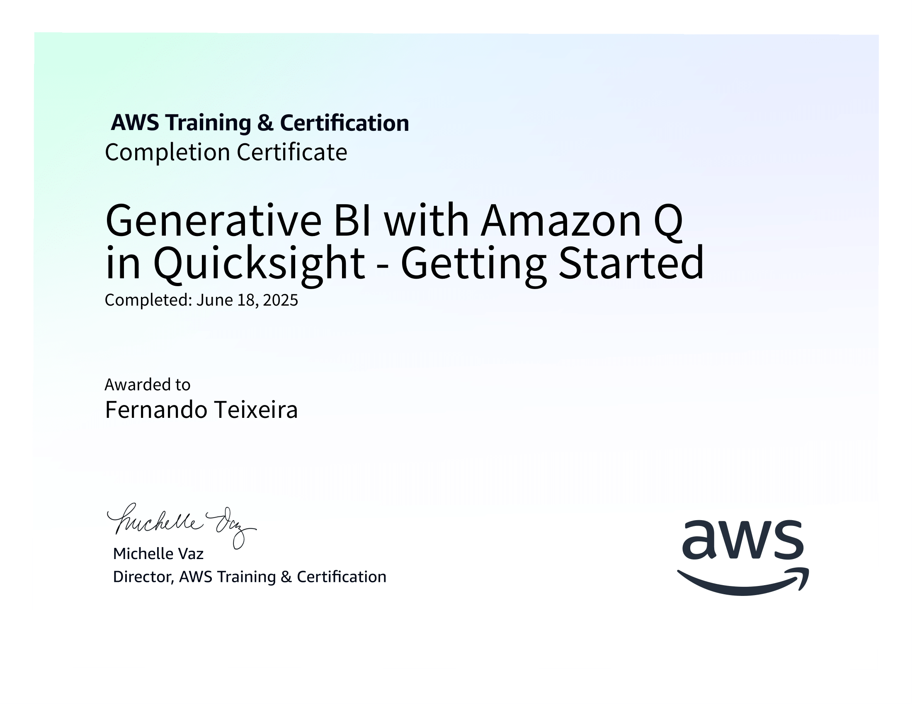
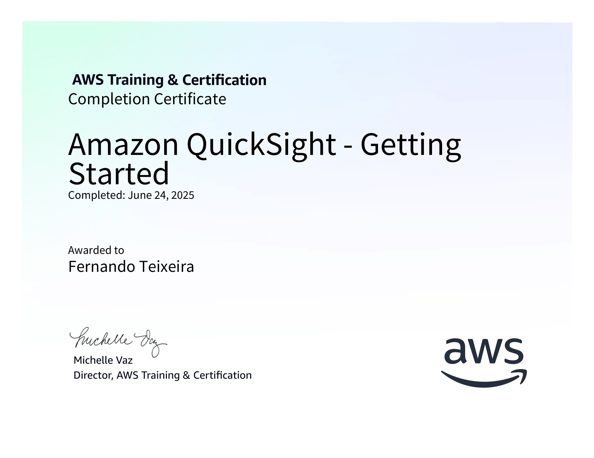

# Resumo

## Laboratório: AWS QuickSight e Fundamentos de Visualização de Dados

### Visão Geral:

Este laboratório tem como objetivo introduzir e capacitar os participantes no uso da ferramenta Amazon QuickSight, abordando tanto aspectos técnicos quanto fundamentos visuais essenciais para construção de dashboards eficazes e orientados a dados. O foco foi desenvolver habilidades práticas em criação de análises, visualizações, filtros interativos e interpretação de métricas, aplicando conceitos de storytelling com dados.

### Tecnologias Utilizadas:

| Tecnologia            | Descrição                                                                       |
| --------------------- | ------------------------------------------------------------------------------- |
| **Amazon QuickSight** | Serviço de BI da AWS usado para criar dashboards interativos e análises visuais |
| **Amazon Athena**     | Consultas SQL sobre dados no S3, com uso de views para enriquecer visualizações |
| **Amazon S3**         | Armazenamento dos dados brutos, tratados e refinados em formato Parquet ou CSV  |
| **AWS Glue**          | ETL serverless utilizado para transformar e organizar os dados antes da análise |
| **Python & SQL**      | Linguagens auxiliares no tratamento, transformação e consulta de dados          |

### O que aprendi:

#### Fundamentos de Visualização de Dados

- Tipos de gráfico e seu uso correto (linha, barra, mapa, KPI, etc.)

- Escolha e uso de cores para facilitar comparações e leitura

- Principais boas práticas de dashboards: clareza, hierarquia visual e foco no objetivo

#### Ferramentas e Recursos do QuickSight

- Importação de datasets via Athena/S3

- Criação e aplicação de filtros interativos

- Uso de campos calculados para KPIs e métricas personalizadas

- Aplicação de gráficos geoespaciais com campos geográficos

- Construção de visualizações temporais e agrupamentos por período

#### Modelagem e Interpretação

- Como interpretar métricas-chave: média, soma, contagem, proporção

- Criação de indicadores como:

    1. Taxa de aprovação

    2. Obras por continente/ano

    3. Volume de notas e média das avaliações

- Correção de inconsistências nos dados através de views ou filtros

### Aplicações Práticas

Este laboratório demonstrou como o QuickSight pode ser aplicado para:

- Análises de comportamento de usuários (ex: volume de avaliações ao longo do tempo)

- Visualização de distribuição geográfica de eventos, vendas ou conteúdos

- Criação de dashboards executivos para monitoramento de KPIs

- Exploração de dados históricos com filtros dinâmicos (data, categoria, origem)

- Apresentações com storytelling, guiando o usuário de forma visual por insights

## Certificados

### Generative BI with Amazon Q in Quicksight - Getting Started (Português)

### Amazon QuickSight - Getting Started (Português)

